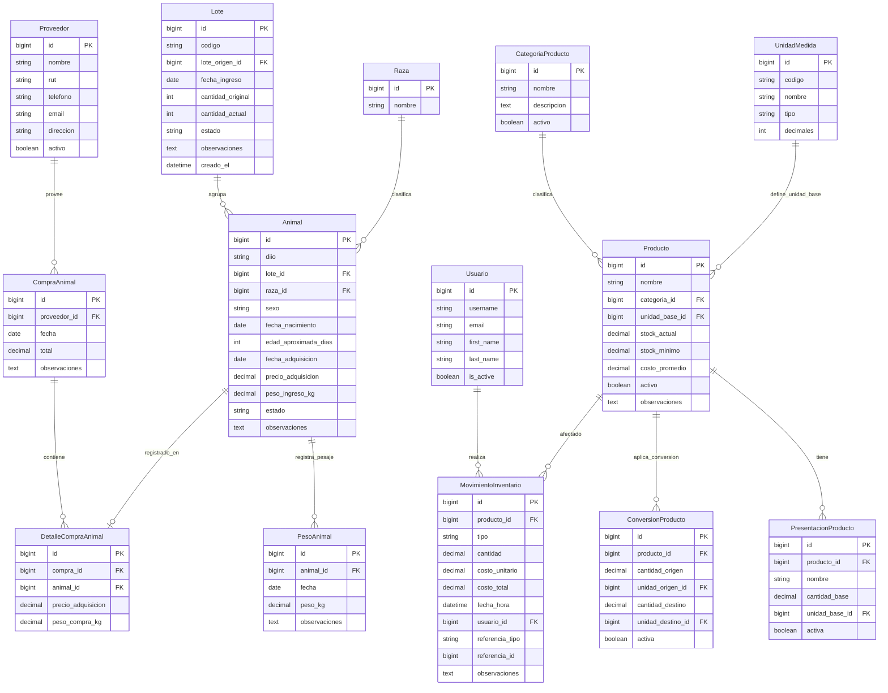

```mermaid
erDiagram

    Usuario ||--o{ MovimientoInventario : "realiza"

    Usuario {
        bigint id PK
        string username
        string email
        string first_name
        string last_name
        boolean is_active
    }

    Lote ||--o{ Animal : "agrupa"

    Lote {
        bigint id PK
        string codigo
        bigint lote_origen_id FK
        date fecha_ingreso
        int cantidad_original
        int cantidad_actual
        string estado
        text observaciones
        datetime creado_el
    }

    Raza ||--o{ Animal : "clasifica"

    Raza {
        bigint id PK
        string nombre
    }

    Animal ||--o{ PesoAnimal : "registra_pesaje"

    Animal {
        bigint id PK
        string diio
        bigint lote_id FK
        bigint raza_id FK
        string sexo
        date fecha_nacimiento
        int edad_aproximada_dias
        date fecha_adquisicion
        decimal precio_adquisicion
        decimal peso_ingreso_kg
        string estado
        text observaciones
    }

    PesoAnimal {
        bigint id PK
        bigint animal_id FK
        date fecha
        decimal peso_kg
        text observaciones
    }

    CategoriaProducto ||--o{ Producto : "clasifica"
    UnidadMedida ||--o{ Producto : "define_unidad_base"
    Producto ||--o{ PresentacionProducto : "tiene"
    Producto ||--o{ ConversionProducto : "aplica_conversion"

    CategoriaProducto {
        bigint id PK
        string nombre
        text descripcion
        boolean activo
    }

    UnidadMedida {
        bigint id PK
        string codigo
        string nombre
        string tipo
        int decimales
    }

    Producto {
        bigint id PK
        string nombre
        bigint categoria_id FK
        bigint unidad_base_id FK
        decimal stock_actual
        decimal stock_minimo
        decimal costo_promedio
        boolean activo
        text observaciones
    }

    PresentacionProducto {
        bigint id PK
        bigint producto_id FK
        string nombre
        decimal cantidad_base
        bigint unidad_base_id FK
        boolean activa
    }

    ConversionProducto {
        bigint id PK
        bigint producto_id FK
        decimal cantidad_origen
        bigint unidad_origen_id FK
        decimal cantidad_destino
        bigint unidad_destino_id FK
        boolean activa
    }

    Producto ||--o{ MovimientoInventario : "afectado"

    MovimientoInventario {
        bigint id PK
        bigint producto_id FK
        string tipo
        decimal cantidad
        decimal costo_unitario
        decimal costo_total
        datetime fecha_hora
        bigint usuario_id FK
        string referencia_tipo
        bigint referencia_id
        text observaciones
    }

    Proveedor ||--o{ CompraAnimal : "provee"
    CompraAnimal ||--o{ DetalleCompraAnimal : "contiene"
    Animal ||--o| DetalleCompraAnimal : "registrado_en"

    Proveedor {
        bigint id PK
        string nombre
        string rut
        string telefono
        string email
        string direccion
        boolean activo
    }

    CompraAnimal {
        bigint id PK
        bigint proveedor_id FK
        date fecha
        decimal total
        text observaciones
    }

    DetalleCompraAnimal {
        bigint id PK
        bigint compra_id FK
        bigint animal_id FK
        decimal precio_adquisicion
        decimal peso_compra_kg
    }
```