# SGIC-Terneros
## Sistema de Gestión de Crianza, Inventario y Costos

> **Documento de análisis, requerimientos, modelo de datos y especificación técnica**
>
> **Versión:** 1.2  
> **Fecha:** agosto de 2026  
> **Entorno previsto:** Debian 12 · Python 3.11+ · Django 5.x · PostgreSQL 15+

---

## Índice

1. [Descripción general](#1-descripción-general)
2. [Problemática y necesidades del negocio](#2-problemática-y-necesidades-del-negocio)
3. [Objetivos del sistema](#3-objetivos-del-sistema)
4. [Alcance del proyecto](#4-alcance-del-proyecto)
5. [Conceptos principales](#5-conceptos-principales)
6. [Requerimientos funcionales](#6-requerimientos-funcionales)
7. [Procesos y flujos del sistema](#7-procesos-y-flujos-del-sistema)
8. [Modelo de costos y rentabilidad](#8-modelo-de-costos-y-rentabilidad)
9. [Modelo de datos](#9-modelo-de-datos)
10. [Arquitectura de la aplicación](#10-arquitectura-de-la-aplicación)
11. [Seguridad, permisos y respaldos](#11-seguridad-permisos-y-respaldos)
12. [Plan de desarrollo y despliegue](#12-plan-de-desarrollo-y-despliegue)
13. [Funcionalidades futuras](#13-funcionalidades-futuras)
14. [Resultado esperado y criterios de éxito](#14-resultado-esperado-y-criterios-de-éxito)
15. [Reglas de negocio](#15-reglas-de-negocio)
16. [Modelo de costos](#16-modelo-de-costos)
17. [Inventario y unidades de medida](#17-inventario-y-unidades-de-medida)
18. [Planes de alimentación](#18-planes-de-alimentación)
19. [Gastos operacionales](#19-gastos-operacionales)
20. [Sanidad y tratamientos](#20-sanidad-y-tratamientos)
21. [Compra de animales](#21-compra-de-animales)
22. [Usuarios, roles y auditoría](#22-usuarios-roles-y-auditoría)
23. [Requisitos no funcionales](#23-requisitos-no-funcionales)
24. [Casos de uso principales](#24-casos-de-uso-principales)
25. [Estados del sistema](#25-estados-del-sistema)
26. [Modelo entidad-relación](#26-modelo-entidad-relación)
27. [Índices y restricciones de base de datos](#27-índices-y-restricciones-de-base-de-datos)
28. [Integridad transaccional](#28-integridad-transaccional)
29. [Pantallas previstas](#29-pantallas-previstas)
30. [Reportes](#30-reportes)
31. [Indicadores del dashboard](#31-indicadores-del-dashboard)
32. [Criterios de aceptación del MVP](#32-criterios-de-aceptación-del-mvp)
33. [Decisiones técnicas pendientes](#33-decisiones-técnicas-pendientes)
34. [Estructura recomendada del proyecto Django](#34-estructura-recomendada-del-proyecto-django)
35. [Estrategia recomendada de implementación](#35-estrategia-recomendada-de-implementación)
36. [Estructura final recomendada de la base de datos](#36-estructura-final-recomendada-de-la-base-de-datos)
37. [Glosario](#37-glosario)
38. [Conclusión del diseño](#38-conclusión-del-diseño)


---

# 1. Descripción general

El proyecto consiste en desarrollar una **aplicación web para gestionar la crianza de terneros**, controlar el inventario de insumos y llevar un seguimiento de los costos asociados a cada lote y animal.

El negocio trabaja aproximadamente con **50 a 100 animales** y utiliza distintos insumos durante el proceso de crianza, entre ellos:

| Categoría | Insumos |
|---|---|
| Alimentación | Sustituto lácteo, concentrado inicial, concentrado de crecimiento |
| Forraje | Heno/fardos, bolos de paja, bolos de silo |
| Veterinaria | Medicamentos y otros insumos veterinarios |

El sistema busca centralizar la información relacionada con:

**Animales → Lotes → Compras → Inventario → Consumos → Gastos → Costos → Ventas → Rentabilidad**

La idea principal es que la persona encargada registre las operaciones que ocurren en el negocio y que el sistema se encargue de relacionarlas y realizar los cálculos correspondientes.

> **Principio general:** registrar una vez y calcular automáticamente.

El sistema no busca reemplazar inicialmente un software de contabilidad tributaria. Su finalidad es entregar **control administrativo, trazabilidad y análisis de costos y rentabilidad** para apoyar las decisiones del negocio.

---

# 2. Problemática y necesidades del negocio

## 2.1 Situación actual

La crianza de terneros genera costos desde la compra del animal hasta su venta. El precio de adquisición, por sí solo, no representa el costo real de crianza.

Durante este período pueden existir gastos relacionados con:

- Alimentación.
- Sustituto lácteo.
- Concentrados.
- Heno.
- Silo.
- Paja.
- Medicamentos.
- Otros gastos operacionales.

A medida que aumenta la cantidad de animales, mantener estos registros manualmente se vuelve más difícil. Además, los insumos se compran en distintos momentos y cantidades, por lo que también es necesario conocer cuánto queda disponible y cuánto dinero se encuentra invertido en inventario.

## 2.2 Problemas identificados

### 2.2.1 Falta de trazabilidad de los costos

No siempre es sencillo determinar cuánto dinero se ha invertido realmente en un lote.

Por ejemplo, un lote puede comenzar con 25 terneros y posteriormente recibir distintos consumos de sustituto lácteo, concentrado, heno y medicamentos. Si estos movimientos se registran por separado, obtener el costo total requiere revisar y relacionar información manualmente.

### 2.2.2 Dificultad para conocer el costo real de cada animal

El precio de compra no representa el costo final del ternero.

> **Costo real = costo de adquisición + costos de crianza**

Un animal adquirido por $180.000 puede terminar teniendo un costo considerablemente mayor después de incorporar alimentación, medicamentos y otros gastos asociados.

### 2.2.3 Control de inventario

El negocio necesita saber:

- Qué productos existen.
- Cuánto stock queda.
- Cuánto se ha comprado.
- Cuánto se ha consumido.
- Qué productos están próximos a agotarse.
- Cuánto dinero está actualmente invertido en inventario.

### 2.2.4 Diferencias entre consumo esperado y consumo real

La alimentación puede establecerse mediante pautas según la edad o etapa de crecimiento. Sin embargo, el consumo real puede diferir del consumo esperado.

Comparar ambos valores permitirá detectar desviaciones y analizar posibles aumentos de costos o consumos fuera de lo esperado.

### 2.2.5 Dificultad para determinar la rentabilidad

Al vender un animal o un lote interesa conocer, como mínimo:

- Precio de venta.
- Costo total de crianza.
- Ganancia obtenida.
- Margen de rentabilidad.
- Costo promedio por animal.
- Costo por kilogramo producido.

---

# 3. Objetivos del sistema

## 3.1 Objetivo general

Desarrollar una aplicación web que permita gestionar animales, inventario, compras, consumos, gastos y ventas, proporcionando información sobre los **costos y la rentabilidad asociados a cada lote de terneros**.

## 3.2 Objetivos específicos

1. Registrar los animales adquiridos.
2. Organizar los animales mediante lotes.
3. Mantener actualizado el inventario de insumos.
4. Registrar compras y proveedores.
5. Registrar el consumo de alimentos e insumos.
6. Establecer pautas de alimentación según edad o etapa del animal.
7. Calcular el consumo teórico de cada lote.
8. Comparar el consumo teórico con el consumo real.
9. Distribuir los costos entre los animales de un lote.
10. Registrar ventas individuales o por lote.
11. Calcular el costo acumulado de crianza.
12. Calcular la rentabilidad de animales y lotes.
13. Generar reportes históricos.
14. Facilitar la toma de decisiones mediante indicadores.

---

# 4. Alcance del proyecto

## 4.1 Alcance inicial (MVP)

La primera versión se concentrará en las operaciones necesarias para llevar el control básico del negocio.

| Módulo | Incluido en el MVP |
|---|---|
| **Animales y lotes** | CRUD de animales, lotes, estados y compra de animales |
| **Inventario** | Productos, categorías, stock, movimientos y stock mínimo |
| **Compras** | Proveedores, compras, detalle de compras y actualización automática del inventario |
| **Consumos** | Registro de consumo, asociación con lote, descuento de inventario y costos |
| **Ventas** | Venta de animales, precio, peso y cambio de estado |
| **Costos** | Costos por lote, costos por animal y utilidad |
| **Dashboard** | Animales, inventario, costos, ventas y rentabilidad |

## 4.2 Fuera del alcance inicial

Para evitar que el proyecto crezca innecesariamente, algunas funcionalidades se consideran para una segunda etapa:

- Lectura de caravanas mediante RFID/QR.
- Fotografías de animales.
- Genealogía.
- Aplicación móvil.
- Reportes avanzados.
- Predicciones.
- Análisis históricos avanzados.
- Integraciones externas.

---

# 5. Conceptos principales

## 5.1 Lote

El **lote** es una de las entidades centrales del sistema.

Representa un grupo de animales que son gestionados conjuntamente durante un período determinado.

### Ejemplo

**Lote L-2026-001**

| Dato | Valor |
|---|---|
| Fecha de ingreso | 28/08/2026 |
| Cantidad inicial | 25 animales |
| Angus | 18 |
| Charolais | 7 |
| Estado | Activo |

Un lote puede tener asociados:

- Animales.
- Consumos.
- Gastos.
- Medicamentos.
- Costos de alimentación.
- Compras relacionadas.
- Ventas.

Esto permitirá conocer el costo acumulado del lote y, posteriormente, distribuirlo entre los animales cuando corresponda.

## 5.2 Animal

Cada animal tendrá una ficha individual.

### Datos principales

| Campo | Descripción |
|---|---|
| Identificador | Identificador interno del sistema |
| Caravana | Número o código identificador del animal |
| Raza | Raza principal |
| Sexo | Macho o hembra |
| Fecha de nacimiento | Fecha real o estimada |
| Fecha de adquisición | Fecha de ingreso al predio |
| Peso de ingreso | Peso inicial en kg |
| Precio de adquisición | Valor de compra |
| Lote | Lote al que pertenece |
| Estado | Situación actual del animal |

### Estados posibles

- `ACTIVO`
- `VENDIDO`
- `FALLECIDO`
- `TRASLADADO`

Posteriormente se podrán registrar:

- Pesajes.
- Tratamientos.
- Medicamentos.
- Cambios de lote.
- Fecha de venta.
- Peso de venta.
- Precio de venta.

## 5.3 Producto

Representa un insumo disponible para la operación del negocio.

Ejemplos:

- Sustituto lácteo.
- Concentrado inicial.
- Concentrado de crecimiento.
- Heno.
- Paja.
- Silo.
- Medicamentos.

Cada producto tendrá información sobre su unidad de medida, stock, stock mínimo y costo.

## 5.4 Movimiento de inventario

Un movimiento representa una entrada, salida o ajuste de stock.

El stock no debería modificarse simplemente editando un número. El sistema debe conservar un historial de los movimientos para poder explicar de dónde proviene el stock actual.

> **Stock actual = stock inicial + entradas − salidas ± ajustes**

---

# 6. Requerimientos funcionales

## 6.1 Gestión de animales

El sistema deberá permitir:

- Crear animales.
- Consultar animales.
- Modificar información.
- Cambiar su estado.
- Asignarlos a un lote.
- Registrar pesajes.
- Registrar tratamientos.
- Registrar información de venta.

## 6.2 Gestión de lotes

Cada lote deberá permitir:

- Crear y cerrar lotes.
- Asociar animales.
- Consultar cantidad de animales.
- Registrar consumos.
- Asociar gastos.
- Consultar costos acumulados.
- Consultar ventas.
- Calcular rentabilidad.

## 6.3 Gestión de inventario

El inventario estará dividido en categorías.

### Alimentos

- Sustituto lácteo.
- Concentrado inicial.
- Concentrado de crecimiento.
- Heno.
- Paja.
- Silo.

### Medicamentos

- Antibióticos.
- Antiinflamatorios.
- Vitaminas.
- Antiparasitarios.
- Otros productos veterinarios.

Cada producto deberá manejar:

- Nombre.
- Categoría.
- Unidad de medida.
- Stock actual.
- Stock mínimo.
- Costo promedio unitario.
- Proveedor habitual.

## 6.4 Movimientos de inventario

Cada movimiento deberá registrar:

| Campo | Descripción |
|---|---|
| Fecha/hora | Momento de la operación |
| Producto | Producto afectado |
| Tipo | Entrada, salida o ajuste |
| Cantidad | Cantidad movida |
| Costo unitario | Costo utilizado |
| Costo total | Cantidad × costo unitario |
| Referencia | Compra u operación relacionada |
| Observación | Motivo o detalle |
| Usuario | Responsable de la operación |

### Ejemplo

**Compra**

```text
Sustituto lácteo
Entrada: +10 sacos
```

**Consumo**

```text
Sustituto lácteo
Salida: -1 saco
```

**Stock resultante**

```text
10 - 1 = 9 sacos
```

El historial permitirá reconstruir los cambios del inventario.

## 6.5 Compras

Una compra podrá registrar:

- Fecha.
- Proveedor.
- Número de factura o guía.
- Productos.
- Cantidades.
- Precio unitario.
- Total.
- Método o condiciones de pago.
- Observaciones.

Una compra tendrá múltiples líneas de detalle.

### Ejemplo

```text
Compra #00125

Sustituto lácteo      10 sacos
Concentrado inicial    5 sacos
Heno                  20 fardos

Total: $XXX.XXX
```

Al confirmar una compra de insumos, el sistema deberá:

1. Registrar la compra.
2. Registrar sus líneas de detalle.
3. Generar la entrada correspondiente en inventario.
4. Actualizar el stock.
5. Recalcular el costo promedio del producto.

## 6.6 Sistema de alimentación

El sistema permitirá definir **pautas de alimentación**.

Una pauta establece el consumo esperado de un animal según su edad o etapa de desarrollo.

### Ejemplo de pauta

> Los siguientes valores son solo ilustrativos. Los valores reales deberán configurarse de acuerdo con el manejo del negocio.

| Etapa | Sustituto lácteo | Concentrado |
|---|---:|---:|
| Etapa 1 | 4 L/día | 0 kg |
| Etapa 2 | 5 L/día | 0,2 kg/día |
| Etapa 3 | 6 L/día | 0,5 kg/día |
| Etapa 4 | 4 L/día | 1 kg/día |

## 6.7 Consumo teórico

El sistema podrá calcular cuánto debería consumir un animal o un lote.

### Ejemplo

Un lote tiene **20 terneros** y la pauta establece **6 litros por ternero al día**.

$$
20 \times 6 = 120\ L/día
$$

El sistema podrá calcular:

- Consumo diario.
- Consumo semanal.
- Consumo mensual.
- Consumo acumulado durante la crianza.

## 6.8 Consumo real

El usuario podrá registrar el consumo efectivamente realizado.

### Ejemplo

```text
Fecha: 28/08/2026
Lote: L-2026-001

Sustituto lácteo:
Consumo real: 110 L

Concentrado:
Consumo real: 22,5 kg
```

La comparación sería:

| Indicador | Valor |
|---|---:|
| Consumo esperado | 120 L |
| Consumo real | 110 L |
| Diferencia | -10 L |

También se podrá calcular la desviación porcentual.

## 6.9 Ventas

El sistema permitirá vender:

- Un animal individual.
- Varios animales.
- Un lote completo.

### Datos de la venta

- Fecha.
- Comprador.
- Animal o lote.
- Peso.
- Precio por kg, cuando corresponda.
- Precio total.
- Forma de pago.
- Observaciones.

Al registrar una venta:

1. El animal cambia a estado `VENDIDO`.
2. Se registra el ingreso.
3. Se determina el costo acumulado.
4. Se calcula la utilidad o pérdida.
5. Se conserva el historial de la operación.

## 6.10 Dashboard

La pantalla principal mostrará una visión general del negocio.

### Indicadores principales

- Animales activos.
- Lotes activos.
- Inventario valorizado.
- Ventas del período.
- Costos del período.
- Utilidad.
- Productos con stock bajo.

### Indicadores productivos

- Peso promedio.
- Ganancia de peso.
- Días promedio de crianza.
- Mortalidad.
- Costo promedio por animal.
- Costo por kg de ganancia.

---

# 7. Procesos y flujos del sistema

## 7.1 Flujo general del negocio

```text
COMPRA DE ANIMALES
        ↓
CREACIÓN DEL LOTE
        ↓
REGISTRO DE ANIMALES
        ↓
ALIMENTACIÓN
        ↓
CONSUMO DE INSUMOS
        ↓
ACUMULACIÓN DE COSTOS
        ↓
PESAJE / CONTROL
        ↓
VENTA
        ↓
CIERRE DEL LOTE
        ↓
CÁLCULO DE RENTABILIDAD
```

En paralelo ocurre el flujo de los insumos:

```text
COMPRA DE INSUMOS
        ↓
INVENTARIO
        ↓
CONSUMO
        ↓
DESCUENTO DE STOCK
        ↓
ASIGNACIÓN DEL COSTO
```

## 7.2 Automatización de movimientos

La aplicación debe reducir la cantidad de información que el usuario debe registrar manualmente.

### Compra de insumos

```text
Compra
  ↓
Detalle de compra
  ↓
Entrada de inventario
  ↓
Actualización de stock
  ↓
Recalculo del costo promedio
```

### Consumo

```text
Consumo
  ↓
Salida de inventario
  ↓
Costo del consumo
  ↓
Asignación al lote
  ↓
Actualización del costo acumulado
```

### Venta

```text
Venta
  ↓
Cambio de estado
  ↓
Costo acumulado
  ↓
Ingreso
  ↓
Utilidad / pérdida
  ↓
Rentabilidad
```

---

# 8. Modelo de costos y rentabilidad

## 8.1 Principio de asignación

El costo de los insumos consumidos se asignará al lote.

### Ejemplo

```text
Lote L-2026-001

Sustituto lácteo       $80.000
Concentrado            $45.000
Heno                   $20.000
Medicamentos           $10.000
--------------------------------
Costo acumulado       $155.000
```

Para obtener un costo individual simple:

```text
Costo del lote:       $155.000
Animales participantes: 25

$155.000 / 25 = $6.200 por animal
```

Sin embargo, el sistema deberá permitir métodos más precisos cuando los animales ingresen o salgan del lote en fechas diferentes.

## 8.2 Costo acumulado por animal

El costo final de un animal se compone de diferentes elementos.

### Ejemplo

**Ternero A-034**

```text
Compra                    $180.000
Sustituto lácteo            $82.500
Concentrado                 $54.000
Heno                        $12.000
Medicamentos                 $8.500
Otros                        $6.000
----------------------------------
Costo acumulado            $343.000
```

Si posteriormente se vende por $520.000:

```text
Ingresos                   $520.000
Costos                     $343.000
----------------------------------
Utilidad                   $177.000
```

## 8.3 Rentabilidad por lote

### Ejemplo

```text
Lote L-2026-001

Compra de animales       $4.500.000
Alimentación               $920.000
Medicamentos                $85.000
Otros gastos                $70.000
------------------------------------
Costo total              $5.575.000

Venta total              $8.085.000
------------------------------------
Utilidad                 $2.510.000
```

Indicadores posibles:

- Utilidad por animal.
- Margen porcentual.
- Costo promedio por animal.
- Ingreso promedio por animal.
- Costo por kilogramo.
- Precio promedio de venta por kilogramo.

## 8.4 Precio Medio Ponderado (PMP)

El inventario utilizará **Precio Medio Ponderado** para valorar el costo unitario de los productos.

Cada nueva compra recalcula el costo promedio:

$$
PMP_{nuevo} =
\frac{
(Stock_{actual}\times PMP_{anterior})+
(Cantidad_{comprada}\times Precio_{compra})
}{
Stock_{actual}+Cantidad_{comprada}
}
$$

El PMP vigente al momento de un consumo será el costo unitario aplicado a dicho consumo.

## 8.5 Fórmulas principales

### Costo total del ternero

$$
Costo\ Total =
Precio\ de\ Adquisición +
\sum Costos\ de\ Crianza\ Asignados
$$

Para una primera aproximación de distribución por lote:

$$
Costo\ Asignado =
\frac{Costo\ del\ Consumo\ del\ Lote}
{Terneros\ Activos\ al\ Momento\ del\ Consumo}
$$

### Ganancia diaria de peso

$$
GDP =
\frac{Peso\ Final-Peso\ Inicial}
{Días\ Transcurridos}
$$

### Margen bruto por lote

$$
Margen\ Bruto =
Ingresos\ Totales\ de\ Venta-Costos\ Totales\ Acumulados
$$

### Desviación del consumo

$$
Desviación\ \% =
\left(
\frac{Consumo\ Real-Consumo\ Teórico}
{Consumo\ Teórico}
\right)\times100
$$

---

# 9. Modelo de datos

## 9.1 Entidades principales

La primera versión del modelo contempla las siguientes entidades:

| Área | Entidades |
|---|---|
| Animales | `Animal`, `Lote`, `PesoAnimal` |
| Proveedores | `Proveedor` |
| Inventario | `Producto`, `CategoriaProducto`, `MovimientoInventario` |
| Compras | `Compra`, `DetalleCompra` |
| Alimentación | `PautaAlimentacion`, `DetallePautaAlimentacion` |
| Consumos | `ConsumoLote`, `DetalleConsumoLote` |
| Ventas | `Venta`, `DetalleVentaAnimal` |
| Sanidad | `Tratamiento`, `DetalleTratamiento` |

## 9.2 Relaciones principales

```text
Proveedor
   │
   └── 1 ─── * Compra
                 │
                 └── 1 ─── * DetalleCompra ─── * ─── 1 Producto
                                                     │
                                                     └── Movimientos de inventario

Lote
   │
   ├── 1 ─── * Animal ─── 1 ─── * PesoAnimal
   │
   └── 1 ─── * ConsumoLote
                    │
                    └── 1 ─── * DetalleConsumoLote ─── * ─── 1 Producto

Venta
   │
   └── 1 ─── * DetalleVentaAnimal ─── * ─── 1 Animal
```

> Este diagrama representa las relaciones conceptuales principales. La implementación concreta puede evolucionar durante el desarrollo.

---

## 9.3 Diccionario de datos

### Tabla `lote`

Unidad organizativa y centro principal de acumulación de costos grupales.

| Campo | Tipo | Requerido | Descripción / regla |
|---|---|:---:|---|
| `id` | BIGINT (PK) | Sí | Autoincremental |
| `codigo` | VARCHAR(50) | Sí | Código único, por ejemplo `L-2026-001` |
| `fecha_ingreso` | DATE | Sí | Fecha de conformación del lote |
| `estado` | VARCHAR(20) | Sí | `ACTIVO` o `CERRADO` |
| `observaciones` | TEXT | No | Notas adicionales |
| `creado_el` | TIMESTAMP | Sí | Fecha y hora de creación |

### Tabla `animal`

Ficha técnica e historial individual de cada bovino.

| Campo | Tipo | Requerido | Descripción / regla |
|---|---|:---:|---|
| `id` | BIGINT (PK) | Sí | Autoincremental |
| `caravana` | VARCHAR(50) | Sí | Código único de caravana/arete |
| `lote_id` | BIGINT (FK) | No | Referencia a `lote.id` |
| `raza` | VARCHAR(50) | Sí | Raza principal |
| `sexo` | CHAR(1) | Sí | `M` = macho, `H` = hembra |
| `fecha_nacimiento` | DATE | No | Fecha real o estimada |
| `fecha_adquisicion` | DATE | Sí | Fecha de ingreso/compra |
| `peso_ingreso` | DECIMAL(6,2) | Sí | Peso inicial en kg |
| `precio_adquisicion` | DECIMAL(12,2) | Sí | Precio de compra |
| `estado` | VARCHAR(20) | Sí | `ACTIVO`, `VENDIDO`, `FALLECIDO`, `TRASLADADO` |
| `observaciones` | TEXT | No | Antecedentes y observaciones |

### Tabla `peso_animal`

Histórico de pesajes.

| Campo | Tipo | Requerido | Descripción / regla |
|---|---|:---:|---|
| `id` | BIGINT (PK) | Sí | Autoincremental |
| `animal_id` | BIGINT (FK) | Sí | Referencia a `animal.id` |
| `fecha` | DATE | Sí | Fecha del pesaje |
| `peso` | DECIMAL(6,2) | Sí | Peso registrado en kg |
| `observaciones` | VARCHAR(200) | No | Observaciones del pesaje |

### Tabla `proveedor`

Catálogo de proveedores de insumos o terneros.

| Campo | Tipo | Requerido | Descripción / regla |
|---|---|:---:|---|
| `id` | BIGINT (PK) | Sí | Autoincremental |
| `nombre` | VARCHAR(150) | Sí | Nombre o razón social |
| `rut_identificacion` | VARCHAR(20) | No | RUT u otra identificación |
| `telefono` | VARCHAR(30) | No | Teléfono |
| `email` | VARCHAR(100) | No | Correo electrónico |
| `direccion` | TEXT | No | Dirección o localidad |

### Tabla `categoria_producto`

Clasificación de los insumos.

| Campo | Tipo | Requerido | Descripción / regla |
|---|---|:---:|---|
| `id` | BIGINT (PK) | Sí | Autoincremental |
| `nombre` | VARCHAR(50) | Sí | Nombre único de la categoría |
| `descripcion` | TEXT | No | Descripción |

### Tabla `producto`

Catálogo de insumos disponibles.

| Campo | Tipo | Requerido | Descripción / regla |
|---|---|:---:|---|
| `id` | BIGINT (PK) | Sí | Autoincremental |
| `nombre` | VARCHAR(100) | Sí | Nombre comercial |
| `categoria_id` | BIGINT (FK) | Sí | Referencia a `categoria_producto.id` |
| `unidad_medida` | VARCHAR(10) | Sí | `KG`, `L`, `SACO`, `FARDO`, `BOLO`, `DOSIS`, `FRASCO` |
| `stock_actual` | DECIMAL(12,2) | Sí | Stock disponible |
| `stock_minimo` | DECIMAL(12,2) | Sí | Umbral de alerta |
| `costo_promedio_unitario` | DECIMAL(12,2) | Sí | PMP calculado |
| `proveedor_habitual_id` | BIGINT (FK) | No | Referencia a `proveedor.id` |

### Tabla `compra`

Encabezado de una adquisición.

| Campo | Tipo | Requerido | Descripción / regla |
|---|---|:---:|---|
| `id` | BIGINT (PK) | Sí | Autoincremental |
| `proveedor_id` | BIGINT (FK) | Sí | Referencia a `proveedor.id` |
| `numero_factura_guia` | VARCHAR(50) | No | Folio del documento |
| `fecha` | DATE | Sí | Fecha de compra |
| `monto_total` | DECIMAL(12,2) | Sí | Suma de las líneas |
| `observaciones` | TEXT | No | Información adicional |

### Tabla `detalle_compra`

Líneas de productos adquiridos.

| Campo | Tipo | Requerido | Descripción / regla |
|---|---|:---:|---|
| `id` | BIGINT (PK) | Sí | Autoincremental |
| `compra_id` | BIGINT (FK) | Sí | Referencia a `compra.id` |
| `producto_id` | BIGINT (FK) | Sí | Referencia a `producto.id` |
| `cantidad` | DECIMAL(10,2) | Sí | Cantidad comprada |
| `precio_unitario` | DECIMAL(12,2) | Sí | Precio unitario |
| `subtotal` | DECIMAL(12,2) | Sí | `cantidad × precio_unitario` |

### Tabla `movimiento_inventario`

Registro histórico de las variaciones de stock.

| Campo | Tipo | Requerido | Descripción / regla |
|---|---|:---:|---|
| `id` | BIGINT (PK) | Sí | Autoincremental |
| `producto_id` | BIGINT (FK) | Sí | Producto afectado |
| `tipo_movimiento` | VARCHAR(20) | Sí | `ENTRADA_COMPRA`, `SALIDA_CONSUMO`, `AJUSTE_POSITIVO`, `AJUSTE_NEGATIVO` |
| `cantidad` | DECIMAL(10,2) | Sí | Cantidad movida |
| `costo_unitario` | DECIMAL(12,2) | Sí | Costo aplicado |
| `costo_total` | DECIMAL(12,2) | Sí | `cantidad × costo_unitario` |
| `fecha_hora` | TIMESTAMP | Sí | Fecha y hora |
| `referencia_compra_id` | BIGINT (FK) | No | Compra relacionada, cuando corresponda |
| `observacion` | TEXT | No | Explicación del movimiento |

### Tabla `pauta_alimentacion`

Estructura base de una pauta.

| Campo | Tipo | Requerido | Descripción / regla |
|---|---|:---:|---|
| `id` | BIGINT (PK) | Sí | Autoincremental |
| `nombre` | VARCHAR(100) | Sí | Nombre de la pauta |
| `descripcion` | TEXT | No | Detalles del manejo |

### Tabla `detalle_pauta_alimentacion`

Ración teórica por animal y etapa.

| Campo | Tipo | Requerido | Descripción / regla |
|---|---|:---:|---|
| `id` | BIGINT (PK) | Sí | Autoincremental |
| `pauta_id` | BIGINT (FK) | Sí | Referencia a `pauta_alimentacion.id` |
| `semana_vida` | INT | Sí | Semana de desarrollo |
| `producto_id` | BIGINT (FK) | Sí | Producto utilizado |
| `cantidad_diaria_por_animal` | DECIMAL(8,2) | Sí | Ración diaria teórica |

### Tabla `consumo_lote`

Encabezado de un evento de consumo de insumos asociado a un lote.

| Campo | Tipo | Requerido | Descripción / regla |
|---|---|:---:|---|
| `id` | BIGINT (PK) | Sí | Autoincremental |
| `lote_id` | BIGINT (FK) | Sí | Referencia a `lote.id` |
| `fecha` | DATE | Sí | Fecha del consumo |
| `costo_total` | DECIMAL(12,2) | Sí | Suma de los detalles |
| `observaciones` | TEXT | No | Novedades |

### Tabla `detalle_consumo_lote`

Detalle de los productos consumidos.

| Campo | Tipo | Requerido | Descripción / regla |
|---|---|:---:|---|
| `id` | BIGINT (PK) | Sí | Autoincremental |
| `consumo_id` | BIGINT (FK) | Sí | Referencia a `consumo_lote.id` |
| `producto_id` | BIGINT (FK) | Sí | Producto consumido |
| `cantidad_consumida` | DECIMAL(10,2) | Sí | Cantidad consumida |
| `costo_unitario_aplicado` | DECIMAL(12,2) | Sí | PMP vigente |
| `subtotal_costo` | DECIMAL(12,2) | Sí | `cantidad_consumida × costo_unitario_aplicado` |

### Tabla `venta`

Registro de la operación comercial.

| Campo | Tipo | Requerido | Descripción / regla |
|---|---|:---:|---|
| `id` | BIGINT (PK) | Sí | Autoincremental |
| `lote_id` | BIGINT (FK) | No | Lote vendido, si corresponde |
| `comprador` | VARCHAR(150) | Sí | Nombre o razón social |
| `fecha` | DATE | Sí | Fecha de venta |
| `precio_total_venta` | DECIMAL(12,2) | Sí | Ingreso total |
| `peso_total_kg` | DECIMAL(10,2) | Sí | Peso total vendido |
| `observaciones` | TEXT | No | Condiciones de la venta |

### Tabla `detalle_venta_animal`

Liquidación individual de cada animal vendido.

| Campo | Tipo | Requerido | Descripción / regla |
|---|---|:---:|---|
| `id` | BIGINT (PK) | Sí | Autoincremental |
| `venta_id` | BIGINT (FK) | Sí | Referencia a `venta.id` |
| `animal_id` | BIGINT (FK) | Sí | Referencia a `animal.id` |
| `peso_venta` | DECIMAL(6,2) | Sí | Peso individual |
| `precio_venta_individual` | DECIMAL(12,2) | Sí | Precio asignado |
| `costo_crianza_acumulado` | DECIMAL(12,2) | Sí | Costo congelado al vender |
| `utilidad_generada` | DECIMAL(12,2) | Sí | `precio_venta_individual − costo_crianza_acumulado` |

---

# 10. Arquitectura de la aplicación

## 10.1 Arquitectura propuesta

Se propone una arquitectura **monolítica modular**, desplegada inicialmente en un servidor local con Debian 12.

```text
┌─────────────────────────────────────────────────────────────┐
│                         CLIENTE                             │
│                    Navegador web                            │
│              HTML5 + Tailwind CSS + Alpine.js               │
└──────────────────────────┬──────────────────────────────────┘
                           │ HTTP / HTTPS
                           ▼
┌─────────────────────────────────────────────────────────────┐
│                       DEBIAN 12                             │
│                                                             │
│  ┌───────────────────────────────────────────────────────┐  │
│  │                         NGINX                         │  │
│  │                    Reverse Proxy                      │  │
│  └──────────────────────────┬────────────────────────────┘  │
│                             │ Unix Socket                   │
│                             ▼                               │
│  ┌───────────────────────────────────────────────────────┐  │
│  │                       GUNICORN                        │  │
│  │                  Servidor WSGI                        │  │
│  └──────────────────────────┬────────────────────────────┘  │
│                             ▼                               │
│  ┌───────────────────────────────────────────────────────┐  │
│  │                    DJANGO 5.X                         │  │
│  │                                                       │  │
│  │  Animales/Lotes │ Inventario │ Consumos │ Costos/Ventas│ │
│  └──────────────────────────┬────────────────────────────┘  │
│                             │ psycopg3                      │
│                             ▼                               │
│  ┌───────────────────────────────────────────────────────┐  │
│  │                    POSTGRESQL 15+                     │  │
│  │                    Base de datos                       │  │
│  └───────────────────────────────────────────────────────┘  │
└─────────────────────────────────────────────────────────────┘
```

## 10.2 Backend

### Django + Python

Django será responsable de:

- Lógica de negocio.
- Autenticación.
- Gestión de usuarios.
- Validaciones.
- Administración de datos.
- Vistas y controladores.
- API, si posteriormente se necesita.

## 10.3 Base de datos

### PostgreSQL

Se utilizará para almacenar las relaciones entre:

- Animales.
- Lotes.
- Productos.
- Compras.
- Consumos.
- Movimientos de inventario.
- Gastos.
- Ventas.
- Pesajes.
- Tratamientos.

## 10.4 Frontend

Para la primera versión se propone utilizar:

- Django Templates.
- HTML.
- Tailwind CSS.
- JavaScript.
- Alpine.js.

No es necesario comenzar con React o Vue. Si posteriormente el proyecto requiere una interfaz más dinámica, se podrá evaluar una SPA o componentes adicionales.

---

# 11. Seguridad, permisos y respaldos

## 11.1 Seguridad del servidor

El servidor Debian deberá aplicar una configuración restrictiva.

### Firewall

Se propone utilizar UFW y permitir únicamente los puertos necesarios:

| Puerto | Servicio | Uso |
|---:|---|---|
| `22` | SSH | Administración remota |
| `80` | HTTP | Acceso web / redirección |
| `443` | HTTPS | Acceso web seguro |

### Usuario de aplicación

El proceso de la aplicación deberá ejecutarse mediante un usuario dedicado, por ejemplo:

```text
appserver
```

Este usuario no deberá disponer de privilegios `sudo` innecesarios.

## 11.2 Respaldos de PostgreSQL

Se propone realizar respaldos diarios con una política de rotación de 30 días.

Script previsto:

```text
/usr/local/bin/backup_sgic.sh
```

Comando base:

```bash
pg_dump -U postgres -d sgic_db | gzip > /var/backups/sgic_postgres/sgic_db_FECHA.sql.gz
```

La ejecución automática podrá programarse mediante `cron`, inicialmente a las **02:00 AM**.

> El respaldo de la base de datos debe considerarse solo una parte de la estrategia. En una implementación real también deberá evaluarse dónde se almacenan las copias y cómo se recuperaría el sistema ante una falla del servidor.

---

# 12. Plan de desarrollo y despliegue

El proyecto se dividirá en cuatro fases.

## Fase 1 — Preparación del entorno

**Objetivo:** dejar funcionando el servidor y la base de datos.

1. Instalar Debian 12.
2. Instalar PostgreSQL 15+.
3. Crear la base de datos `sgic_db`.
4. Crear el usuario de base de datos.
5. Preparar Python 3.11+.
6. Crear el entorno virtual `venv`.
7. Instalar Django y dependencias.

## Fase 2 — Estructura de datos e inventario

**Objetivo:** implementar la base sobre la que funcionará el resto del sistema.

1. Crear los modelos Django.
2. Generar y ejecutar migraciones.
3. Implementar el catálogo de productos.
4. Implementar categorías.
5. Implementar proveedores.
6. Implementar compras.
7. Implementar movimientos de inventario.
8. Implementar cálculo del PMP.
9. Construir la interfaz de inventario.

## Fase 3 — Animales, lotes, alimentación y ventas

**Objetivo:** implementar la operación principal de crianza.

1. Implementar animales.
2. Implementar lotes.
3. Implementar pesajes.
4. Implementar pautas de alimentación.
5. Implementar consumos por lote.
6. Descontar automáticamente el inventario.
7. Asignar costos a los lotes.
8. Implementar ventas.
9. Calcular utilidad y rentabilidad.

## Fase 4 — Publicación y puesta en marcha

**Objetivo:** dejar la aplicación funcionando como servicio.

1. Configurar Gunicorn mediante `systemd`.
2. Configurar Nginx como proxy inverso.
3. Configurar archivos estáticos.
4. Configurar HTTPS cuando corresponda.
5. Configurar respaldos automáticos.
6. Probar recuperación de respaldos.
7. Realizar pruebas de funcionamiento.
8. Poner el sistema en producción.

---

# 13. Funcionalidades futuras

Una vez estable el MVP, se podrán incorporar nuevas funciones.

| Área | Funcionalidades posibles |
|---|---|
| Animales | RFID/QR, fotografías, genealogía |
| Inventario | Código de barras, control de mermas y caducidad |
| Alimentación | Proyección de gasto y alertas de consumo |
| Salud | Calendario de vacunación, desparasitación e historial veterinario |
| Producción | Ganancia diaria de peso, conversión alimenticia y gráficos |
| Ventas | Reportes avanzados y comparación de resultados |
| Gestión | Usuarios y permisos más detallados |
| Reportes | Exportación a Excel/PDF y reportes mensuales |
| Movilidad | Aplicación móvil |
| Análisis | Comparación de rentabilidad entre razas y lotes |
| Predicción | Proyección de costos y gasto de alimentación |

---

# 14. Resultado esperado y criterios de éxito

## 14.1 Preguntas que el sistema debe poder responder

### Inventario

> ¿Cuánto sustituto lácteo tenemos?

> ¿Cuánto concentrado queda?

> ¿Qué productos están por agotarse?

### Animales

> ¿Cuántos terneros tenemos actualmente?

> ¿Qué animales pertenecen a cada lote?

> ¿Cuánto pesa cada animal?

### Costos

> ¿Cuánto hemos invertido en este lote?

> ¿Cuánto cuesta mantener un ternero?

> ¿Cuánto gastamos en alimentación?

### Producción

> ¿Cuánto alimento debería consumir el lote?

> ¿Cuánto consumió realmente?

> ¿Estamos gastando más de lo esperado?

### Ventas

> ¿Cuánto dinero generó este lote?

> ¿Cuánto ganamos por animal?

> ¿Cuál fue el margen?

### Gestión

> ¿Qué lote fue más rentable?

> ¿Qué insumo representa el mayor costo?

> ¿Cuánto dinero tenemos actualmente invertido en animales e inventario?

## 14.2 Criterio de éxito

El proyecto se considerará exitoso cuando el negocio pueda utilizar la aplicación como fuente central de información para responder:

> **¿Qué tenemos → qué compramos → qué consumimos → cuánto gastamos → qué vendimos → cuánto ganamos?**

Además, la aplicación deberá:

- Reducir la duplicación de datos.
- Mantener trazabilidad de las operaciones.
- Automatizar los cálculos derivados.
- Facilitar la consulta histórica.
- Permitir identificar costos y rentabilidad.

El usuario debería registrar principalmente **hechos del negocio**, mientras que el sistema se encargará de establecer las relaciones y realizar los cálculos necesarios.

---

## 14.3 Principio de diseño

La aplicación seguirá una idea sencilla:

> ### **Registrar una vez. Calcular automáticamente.**

Por ejemplo, al registrar una compra de sustituto lácteo, el usuario no debería tener que actualizar manualmente el stock.

El sistema debe encargarse de:

```text
Compra
  ↓
Entrada de inventario
  ↓
Actualización de stock
  ↓
Actualización del costo promedio
```

Y al registrar un consumo:

```text
Consumo
  ↓
Salida de inventario
  ↓
Costo del consumo
  ↓
Asignación al lote
  ↓
Actualización del costo acumulado
```

Finalmente:

```text
Venta
  ↓
Cierre del animal/lote
  ↓
Costo acumulado
  ↓
Ingreso
  ↓
Utilidad / pérdida
  ↓
Rentabilidad
```

---


---

# 15. Reglas de negocio

Esta sección define reglas que la aplicación deberá respetar. La idea es evitar que una operación válida desde el punto de vista de la interfaz produzca datos inconsistentes.

## 15.1 Reglas para animales

| ID | Regla |
|---|---|
| RN-AN-01 | Cada animal debe tener una caravana única cuando esta información esté disponible. |
| RN-AN-02 | Un animal activo debe pertenecer a un lote activo, salvo que el negocio permita animales sin lote temporalmente. |
| RN-AN-03 | Un animal vendido no puede volver a aparecer como activo mediante una edición normal. |
| RN-AN-04 | Un animal fallecido no puede registrar una venta posterior. |
| RN-AN-05 | El peso debe ser mayor que cero. |
| RN-AN-06 | La fecha de nacimiento no puede ser posterior a la fecha de adquisición. |
| RN-AN-07 | La fecha de venta no puede ser anterior a la fecha de adquisición. |
| RN-AN-08 | Los datos históricos de un animal vendido no deben eliminarse. |

## 15.2 Reglas para lotes

| ID | Regla |
|---|---|
| RN-LO-01 | El código del lote debe ser único. |
| RN-LO-02 | Un lote cerrado no debe aceptar nuevos consumos ni animales mediante operaciones normales. |
| RN-LO-03 | El cierre de un lote debe conservar sus costos e historial. |
| RN-LO-04 | La cantidad de animales debe derivarse de los registros y no depender únicamente de un contador manual. |
| RN-LO-05 | Los movimientos de animales entre lotes deben quedar registrados históricamente. |

## 15.3 Reglas para inventario

| ID | Regla |
|---|---|
| RN-IN-01 | El stock no debe modificarse directamente desde un formulario de producto. |
| RN-IN-02 | Toda modificación de stock debe generar un movimiento. |
| RN-IN-03 | No se debe permitir stock negativo, salvo que se habilite explícitamente esta opción. |
| RN-IN-04 | Una salida de inventario debe indicar su motivo o referencia. |
| RN-IN-05 | Una compra confirmada debe generar entradas de inventario automáticamente. |
| RN-IN-06 | Un consumo confirmado debe generar una salida de inventario automáticamente. |
| RN-IN-07 | Un movimiento confirmado no debe eliminarse físicamente; si existe un error, debe realizarse una reversa o ajuste trazable. |

## 15.4 Reglas para compras

| ID | Regla |
|---|---|
| RN-CO-01 | Una compra debe tener al menos una línea de detalle. |
| RN-CO-02 | La cantidad debe ser mayor que cero. |
| RN-CO-03 | El precio unitario no puede ser negativo. |
| RN-CO-04 | El total debe coincidir con la suma de sus líneas. |
| RN-CO-05 | La confirmación de la compra debe realizarse en una transacción atómica. |
| RN-CO-06 | Una compra anulada no debe dejar stock que no corresponda. |

## 15.5 Reglas para consumos

| ID | Regla |
|---|---|
| RN-CS-01 | El consumo debe estar asociado a un lote. |
| RN-CS-02 | Cada línea debe indicar producto y cantidad. |
| RN-CS-03 | El sistema debe verificar el stock disponible antes de confirmar. |
| RN-CS-04 | El costo aplicado debe quedar almacenado en el detalle para conservar el valor histórico. |
| RN-CS-05 | Una corrección de consumo debe revertir el movimiento anterior y crear el nuevo movimiento. |

## 15.6 Reglas para ventas

| ID | Regla |
|---|---|
| RN-VE-01 | Una venta debe contener al menos un animal cuando se trate de venta por animales. |
| RN-VE-02 | Un animal no puede venderse dos veces. |
| RN-VE-03 | Al confirmar una venta, el estado del animal debe pasar a `VENDIDO`. |
| RN-VE-04 | El costo acumulado utilizado para calcular la rentabilidad debe quedar congelado en el momento de la venta. |
| RN-VE-05 | La utilidad debe calcularse a partir del ingreso y del costo reconocido para la venta. |
| RN-VE-06 | Una venta anulada debe conservarse en el historial y revertir sus efectos mediante una operación controlada. |

---

# 16. Modelo de costos

Para el MVP se prioriza obtener correctamente el **costo total del lote** y el costo promedio por animal.

El costo acumulado se compone de:

```text
Costo de adquisición de animales
+ Costo de alimentación
+ Otros costos imputables al lote
= Costo acumulado del lote
```

El costo promedio por animal se obtiene mediante:

$$
CostoPromedioAnimal =
\frac{CostoAcumuladoLote}{CantidadAnimales}
$$

### Ejemplo

```text
Costo de adquisición     $4.000.000
Alimentación                $750.000
Sanidad                      $80.000
────────────────────────────────────
Costo acumulado            $4.830.000

10 animales

$4.830.000 / 10 = $483.000 por animal
```

No se incorporarán inicialmente métodos avanzados de distribución de costos. Estos podrán evaluarse posteriormente dentro del proceso de **mejora continua**, una vez que el sistema base esté funcionando y exista información real para determinar si aportan valor.

# 17. Inventario y unidades de medida

El inventario utilizará una **unidad base** para cada producto. En los productos de alimentación que correspondan, la unidad principal será el **kilogramo (kg)**.

La unidad de inventario debe coincidir con la forma en que se compra, almacena y consume el producto, evitando convertir innecesariamente los movimientos a litros u otras unidades.

## 17.1 Ejemplo: sustituto lácteo

Supongamos:

| Dato | Valor |
|---|---:|
| Presentación | Saco |
| Contenido | 25 kg |
| Unidad de inventario | kg |
| Conversión informativa | 125 g = 1 L |

Si se compran dos sacos:

```text
2 × 25 kg = 50 kg
```

El stock será:

```text
50 kg
```

Si posteriormente se consumen 4 kg:

```text
50 kg - 4 kg = 46 kg
```

Los litros preparados pueden calcularse como información complementaria:

```text
4 kg = 4.000 g

4.000 / 125 = 32 L
```

Por lo tanto:

> 4 kg de sustituto ≈ 32 litros de leche preparada.

Los litros no reemplazan la unidad de inventario.

## 17.2 Tabla `unidad_medida`

| Campo | Tipo | Requerido | Descripción |
|---|---|:---:|---|
| `id` | BIGINT (PK) | Sí | Identificador |
| `codigo` | VARCHAR(20) | Sí | `KG`, `L`, `UN`, etc. |
| `nombre` | VARCHAR(50) | Sí | Nombre de la unidad |
| `tipo` | VARCHAR(30) | Sí | Peso, volumen, unidad, etc. |
| `decimales` | INT | Sí | Decimales permitidos |

## 17.3 Tabla `presentacion_producto`

| Campo | Tipo | Requerido | Descripción |
|---|---|:---:|---|
| `id` | BIGINT (PK) | Sí | Identificador |
| `producto_id` | BIGINT (FK) | Sí | Producto |
| `nombre` | VARCHAR(50) | Sí | Ej. saco 25 kg |
| `cantidad_base` | DECIMAL(12,3) | Sí | Cantidad contenida |
| `unidad_base_id` | BIGINT (FK) | Sí | Unidad base |
| `codigo` | VARCHAR(50) | No | Código de presentación |

## 17.4 Conversión de productos

Cuando un producto tenga una equivalencia útil, esta podrá registrarse para generar información complementaria.

Para el sustituto lácteo:

```text
0,125 kg → 1 L
1 kg     → 8 L
```

La conversión será configurable y no deberá quedar escrita directamente en el código.

---

# 18. Planes de alimentación

Los planes de alimentación serán **independientes de los lotes**.

Un plan representa una pauta reutilizable que define la alimentación correspondiente a una determinada etapa de edad o desarrollo. Posteriormente, el plan puede asignarse a uno o más lotes.

```text
              PLAN DE ALIMENTACIÓN
                       │
          ┌────────────┼────────────┐
          ↓            ↓            ↓
       Lote 001     Lote 002     Lote 003
```

Esto permite que varios lotes que se encuentren en una etapa similar utilicen la misma pauta.

## 18.1 Tabla `plan_alimentacion`

| Campo | Tipo | Requerido | Descripción |
|---|---|:---:|---|
| `id` | BIGINT (PK) | Sí | Identificador |
| `nombre` | VARCHAR(100) | Sí | Nombre del plan |
| `edad_desde_dias` | INT | No | Edad mínima |
| `edad_hasta_dias` | INT | No | Edad máxima |
| `activo` | BOOLEAN | Sí | Disponible para asignación |
| `observaciones` | TEXT | No | Notas |

Ejemplo:

| Plan | Edad desde | Edad hasta |
|---|---:|---:|
| Inicio | 0 días | 15 días |
| Crecimiento 1 | 16 días | 30 días |
| Crecimiento 2 | 31 días | 45 días |

## 18.2 Tabla `detalle_plan_alimentacion`

Las cantidades se expresarán como **kg por animal por día**.

| Campo | Tipo | Requerido | Descripción |
|---|---|:---:|---|
| `id` | BIGINT (PK) | Sí | Identificador |
| `plan_id` | BIGINT (FK) | Sí | Plan |
| `producto_id` | BIGINT (FK) | Sí | Producto |
| `cantidad_diaria_kg` | DECIMAL(10,3) | Sí | Kg por animal al día |
| `observaciones` | TEXT | No | Notas |

Ejemplo:

| Producto | Cantidad por animal/día |
|---|---:|
| Sustituto lácteo | 4 kg |
| Concentrado | 1 kg |
| Heno | 0,5 kg |

## 18.3 Tabla `asignacion_plan_lote`

| Campo | Tipo | Requerido | Descripción |
|---|---|:---:|---|
| `id` | BIGINT (PK) | Sí | Identificador |
| `lote_id` | BIGINT (FK) | Sí | Lote |
| `plan_id` | BIGINT (FK) | Sí | Plan asignado |
| `fecha_inicio` | DATE | Sí | Inicio de aplicación |
| `fecha_fin` | DATE | No | Fin de aplicación |
| `observaciones` | TEXT | No | Notas |

Un mismo lote puede utilizar distintos planes durante su crianza:

```text
Lote 001
│
├── Plan Inicio
├── Plan Crecimiento 1
├── Plan Crecimiento 2
└── Plan Final
```

Los planes continúan siendo independientes y reutilizables.

## 18.4 Cálculo del consumo esperado

Si el plan establece:

```text
4 kg/animal/día
```

y el lote contiene:

```text
10 animales
```

el consumo esperado del lote será:

```text
4 × 10 = 40 kg/día
```

Para 15 días:

```text
40 × 15 = 600 kg
```

Esto permite comparar posteriormente el consumo planificado con el consumo real.

## 18.5 Conversión informativa a litros

Si el producto tiene registrada la equivalencia:

```text
125 g = 1 L
```

entonces:

```text
4 kg = 4.000 g
4.000 / 125 = 32 L
```

El sistema podrá mostrar:

> 4 kg/animal/día ≈ 32 L de leche preparada/animal/día.

La unidad principal del plan continúa siendo el kilogramo.

# 19. Gastos operacionales

El documento original hablaba de "otros gastos", pero no definía cómo registrarlos.

Se recomienda incorporar un módulo de gastos.

## 18.1 Tabla `categoria_gasto`

| Campo | Tipo | Requerido | Descripción |
|---|---|:---:|---|
| `id` | BIGINT (PK) | Sí | Identificador |
| `nombre` | VARCHAR(80) | Sí | Nombre |
| `descripcion` | TEXT | No | Descripción |

Ejemplos:

- Transporte.
- Mano de obra.
- Veterinaria.
- Mantención.
- Servicios.
- Otros.

## 18.2 Tabla `gasto`

| Campo | Tipo | Requerido | Descripción |
|---|---|:---:|---|
| `id` | BIGINT (PK) | Sí | Identificador |
| `categoria_id` | BIGINT (FK) | Sí | Categoría |
| `proveedor_id` | BIGINT (FK) | No | Proveedor, si corresponde |
| `lote_id` | BIGINT (FK) | No | Lote al que se asigna |
| `fecha` | DATE | Sí | Fecha |
| `descripcion` | VARCHAR(200) | Sí | Motivo |
| `monto` | DECIMAL(12,2) | Sí | Valor |
| `documento` | VARCHAR(50) | No | Factura/boleta/etc. |
| `estado` | VARCHAR(20) | Sí | Registrado, anulado |
| `observaciones` | TEXT | No | Detalles |

## 18.3 Gastos generales versus gastos del lote

No todo gasto debe asignarse automáticamente a un lote.

Por ejemplo:

```text
Compra de medicamentos para Lote A
→ gasto asignable al Lote A

Mantención general del galpón
→ gasto general
```

El sistema debe distinguir ambos casos.

---

# 20. Sanidad y tratamientos

La sanidad debe separarse de los productos de inventario.

Un medicamento es un **producto**.

Un tratamiento es una **operación realizada sobre un animal**.

## 19.1 Tabla `tratamiento`

| Campo | Tipo | Requerido | Descripción |
|---|---|:---:|---|
| `id` | BIGINT (PK) | Sí | Identificador |
| `animal_id` | BIGINT (FK) | Sí | Animal tratado |
| `fecha` | DATE | Sí | Fecha |
| `motivo` | VARCHAR(150) | Sí | Motivo del tratamiento |
| `diagnostico` | VARCHAR(200) | No | Diagnóstico registrado |
| `veterinario` | VARCHAR(150) | No | Profesional |
| `observaciones` | TEXT | No | Detalles |

## 19.2 Tabla `detalle_tratamiento`

| Campo | Tipo | Requerido | Descripción |
|---|---|:---:|---|
| `id` | BIGINT (PK) | Sí | Identificador |
| `tratamiento_id` | BIGINT (FK) | Sí | Tratamiento |
| `producto_id` | BIGINT (FK) | Sí | Medicamento utilizado |
| `cantidad` | DECIMAL(10,3) | Sí | Cantidad aplicada |
| `unidad_medida_id` | BIGINT (FK) | Sí | Unidad |
| `costo_unitario` | DECIMAL(12,2) | Sí | Costo aplicado |
| `costo_total` | DECIMAL(12,2) | Sí | Costo del medicamento |

Esto permite que un tratamiento descuente inventario y, al mismo tiempo, genere un costo asociado al animal.

---

# 21. Compra de animales

El modelo anterior registraba el precio de adquisición dentro de `animal`, pero falta representar correctamente la operación de compra cuando se adquieren varios animales.

Se recomienda separar:

- **Animal:** información del individuo.
- **Compra de animales:** operación comercial.
- **Detalle de compra:** animales incluidos en esa operación.

## 20.1 Tabla `compra_animal`

| Campo | Tipo | Requerido | Descripción |
|---|---|:---:|---|
| `id` | BIGINT (PK) | Sí | Identificador |
| `proveedor_id` | BIGINT (FK) | No | Vendedor/proveedor |
| `fecha` | DATE | Sí | Fecha de compra |
| `documento` | VARCHAR(50) | No | Factura, guía, etc. |
| `monto_total` | DECIMAL(12,2) | Sí | Total |
| `observaciones` | TEXT | No | Detalles |

## 20.2 Tabla `detalle_compra_animal`

| Campo | Tipo | Requerido | Descripción |
|---|---|:---:|---|
| `id` | BIGINT (PK) | Sí | Identificador |
| `compra_animal_id` | BIGINT (FK) | Sí | Compra |
| `animal_id` | BIGINT (FK) | Sí | Animal |
| `precio_adquisicion` | DECIMAL(12,2) | Sí | Precio individual |
| `peso_compra` | DECIMAL(8,2) | No | Peso al comprar |

Esto permite conocer qué animales fueron comprados juntos y cuál fue su costo individual.

---

# 22. Usuarios, roles y auditoría

Si la aplicación será utilizada por más de una persona, debe existir control de acceso.

## 21.1 Roles iniciales

| Rol | Permisos principales |
|---|---|
| Administrador | Acceso completo y configuración |
| Encargado | Animales, lotes, inventario, consumos y ventas |
| Consulta | Solo lectura |

Los nombres pueden cambiar durante la implementación.

## 21.2 Auditoría

Las operaciones críticas deberían registrar:

- Usuario.
- Fecha/hora.
- Acción.
- Entidad afectada.
- Identificador.
- Valor anterior, cuando corresponda.
- Valor nuevo, cuando corresponda.

### Tabla `registro_auditoria`

| Campo | Tipo | Requerido | Descripción |
|---|---|:---:|---|
| `id` | BIGINT (PK) | Sí | Identificador |
| `usuario_id` | BIGINT (FK) | No | Usuario responsable |
| `fecha_hora` | TIMESTAMP | Sí | Momento |
| `accion` | VARCHAR(30) | Sí | Crear, modificar, anular, etc. |
| `entidad` | VARCHAR(80) | Sí | Modelo afectado |
| `entidad_id` | BIGINT | Sí | Registro afectado |
| `datos_anteriores` | JSONB | No | Estado anterior |
| `datos_nuevos` | JSONB | No | Estado nuevo |
| `ip` | INET | No | IP de origen |

La auditoría es especialmente útil para inventario, costos, ventas y anulaciones.

---

# 23. Requisitos no funcionales

Los requerimientos funcionales indican **qué hace el sistema**. Los no funcionales indican **cómo debe comportarse**.

## 22.1 Seguridad

| ID | Requisito |
|---|---|
| RNF-SEG-01 | Las contraseñas deben almacenarse utilizando los mecanismos de hash de Django. |
| RNF-SEG-02 | Las vistas deberán exigir autenticación cuando corresponda. |
| RNF-SEG-03 | Los permisos deberán controlarse en servidor y no solamente en la interfaz. |
| RNF-SEG-04 | La aplicación deberá utilizar HTTPS cuando sea accesible fuera de la red local. |
| RNF-SEG-05 | Las credenciales y secretos no deben almacenarse directamente en el repositorio. |

## 22.2 Disponibilidad y recuperación

| ID | Requisito |
|---|---|
| RNF-DIS-01 | La base de datos deberá contar con respaldos periódicos. |
| RNF-DIS-02 | Deberá existir un procedimiento documentado de restauración. |
| RNF-DIS-03 | Los respaldos deberán almacenarse fuera del directorio principal de la aplicación. |
| RNF-DIS-04 | Periódicamente se deberá comprobar que un respaldo puede restaurarse correctamente. |

## 22.3 Rendimiento

Para el tamaño inicial esperado, no se requiere una arquitectura distribuida.

El sistema deberá:

- Cargar las operaciones habituales sin esperas innecesarias.
- Utilizar índices en claves y campos de consulta frecuente.
- Evitar consultas repetitivas innecesarias.
- Utilizar paginación en listados grandes.

## 22.4 Mantenibilidad

La aplicación deberá:

- Separar la lógica de negocio de las plantillas.
- Utilizar nombres consistentes.
- Mantener migraciones controladas.
- Evitar duplicación innecesaria.
- Registrar errores de aplicación.

---

# 24. Casos de uso principales

## CU-01 — Registrar compra de insumos

**Actor:** Administrador / Encargado

**Precondiciones:**

- El usuario está autenticado.
- El proveedor existe.
- Los productos están registrados.

**Flujo:**

1. El usuario crea una compra.
2. Selecciona proveedor.
3. Agrega productos.
4. Indica cantidades.
5. Indica precios.
6. El sistema calcula subtotales.
7. El usuario confirma.
8. El sistema guarda la compra.
9. Se generan movimientos de entrada.
10. Se actualiza el stock.
11. Se recalcula el PMP.

**Resultado:** inventario actualizado y compra registrada.

## CU-02 — Registrar consumo

**Actor:** Encargado

**Flujo:**

1. Seleccionar lote.
2. Seleccionar fecha.
3. Seleccionar productos.
4. Indicar cantidades.
5. El sistema consulta el stock.
6. Calcula el costo usando el costo vigente.
7. El usuario confirma.
8. Se genera la salida de inventario.
9. Se registra el costo del lote.

## CU-03 — Registrar pesaje

**Actor:** Encargado

**Flujo:**

1. Seleccionar animal.
2. Indicar fecha.
3. Introducir peso.
4. Guardar.
5. El sistema incorpora el dato al historial.

## CU-04 — Registrar venta

**Actor:** Administrador / Encargado

**Flujo:**

1. Crear venta.
2. Seleccionar animales.
3. Registrar peso de venta.
4. Registrar precio.
5. Confirmar.
6. Congelar costo acumulado.
7. Calcular utilidad.
8. Cambiar estado de los animales a `VENDIDO`.

## CU-05 — Consultar rentabilidad

**Actor:** Administrador

**Flujo:**

1. Seleccionar período, lote o animal.
2. El sistema consulta ingresos.
3. Consulta costos.
4. Calcula utilidad.
5. Muestra indicadores.

---

# 25. Estados del sistema

## 24.1 Estado del animal

```text
                 ┌─────────────┐
                 │   ACTIVO    │
                 └──────┬──────┘
                        │
          ┌─────────────┼─────────────┐
          ↓             ↓             ↓
      VENDIDO       FALLECIDO     TRASLADADO
```

Los cambios deberán quedar registrados.

## 24.2 Estado del lote

```text
CREADO
  ↓
ACTIVO
  ↓
CERRADO
```

Un lote cerrado conserva su información histórica.

## 24.3 Estado de una compra

```text
BORRADOR
   ↓
CONFIRMADA
   ↓
ANULADA
```

No se recomienda eliminar físicamente una compra confirmada.

## 24.4 Estado de una venta

```text
BORRADOR
   ↓
CONFIRMADA
   ↓
ANULADA
```

---

# 26. Modelo entidad-relación

Typora puede renderizar este diagrama Mermaid si la opción está habilitada.

```mermaid
erDiagram

    LOTE ||--|{ ANIMAL : contiene

    ANIMAL ||--o{ PESO_ANIMAL : registra

    PROVEEDOR ||--o{ COMPRA_INSUMO : realiza
    COMPRA_INSUMO ||--|{ DETALLE_COMPRA : contiene
    PRODUCTO ||--o{ DETALLE_COMPRA : incluye

    PRODUCTO ||--o{ MOVIMIENTO_INVENTARIO : genera

    LOTE ||--o{ CONSUMO_LOTE : recibe
    CONSUMO_LOTE ||--|{ DETALLE_CONSUMO : contiene
    PRODUCTO ||--o{ DETALLE_CONSUMO : utilizado

    PAUTA_ALIMENTACION ||--|{ DETALLE_PAUTA : contiene
    PRODUCTO ||--o{ DETALLE_PAUTA : utiliza

    PROVEEDOR ||--o{ COMPRA_ANIMAL : vende
    COMPRA_ANIMAL ||--|{ DETALLE_COMPRA_ANIMAL : contiene
    ANIMAL ||--o| DETALLE_COMPRA_ANIMAL : adquirido

    CATEGORIA_GASTO ||--o{ GASTO : clasifica
    LOTE ||--o{ GASTO : recibe

    ANIMAL ||--o{ TRATAMIENTO : recibe
    TRATAMIENTO ||--|{ DETALLE_TRATAMIENTO : contiene
    PRODUCTO ||--o{ DETALLE_TRATAMIENTO : medicamento

    VENTA ||--|{ DETALLE_VENTA_ANIMAL : contiene
    ANIMAL ||--o| DETALLE_VENTA_ANIMAL : vendido

    LOTE ||--o{ ASIGNACION_COSTO_ANIMAL : origen
    ANIMAL ||--o{ ASIGNACION_COSTO_ANIMAL : recibe

    CATEGORIA_PRODUCTO ||--o{ PRODUCTO : clasifica
    UNIDAD_MEDIDA ||--o{ PRODUCTO : unidad_base

    PRODUCTO ||--o{ PRESENTACION_PRODUCTO : tiene
    UNIDAD_MEDIDA ||--o{ PRESENTACION_PRODUCTO : utiliza

    PRODUCTO ||--o{ RECETA_PREPARACION : participa
    PLAN_ALIMENTACION ||--|{ DETALLE_PLAN_ALIMENTACION : contiene
    PRODUCTO ||--o{ DETALLE_PLAN_ALIMENTACION : utiliza
    LOTE ||--o{ ASIGNACION_PLAN_LOTE : recibe
    PLAN_ALIMENTACION ||--o{ ASIGNACION_PLAN_LOTE : asignado

    USUARIO ||--o{ REGISTRO_AUDITORIA : genera
```



---

# 27. Índices y restricciones de base de datos

Además de las claves primarias y foráneas, se deberán definir restricciones para proteger la integridad.

## 26.1 Restricciones recomendadas

| Tabla | Restricción |
|---|---|
| `animal` | `caravana` única cuando esté informada |
| `lote` | `codigo` único |
| `categoria_producto` | `nombre` único |
| `unidad_medida` | `codigo` único |
| `producto` | combinación de nombre/presentación según diseño |
| `animal_lote` | evitar períodos superpuestos para el mismo animal |
| `detalle_venta_animal` | un animal no debe estar dos veces en una venta |
| `detalle_compra` | cantidad > 0 |
| `detalle_consumo_lote` | cantidad > 0 |
| `peso_animal` | peso > 0 |
| `gasto` | monto >= 0 |

## 26.2 Índices recomendados

Los campos consultados frecuentemente deberían tener índices, especialmente:

```text
animal.caravana
animal.estado
animal_lote.lote_id
animal_lote.animal_id
peso_animal.animal_id
movimiento_inventario.producto_id
movimiento_inventario.fecha_hora
consumo_lote.lote_id
consumo_lote.fecha
venta.fecha
detalle_venta_animal.animal_id
gasto.lote_id
gasto.fecha
```

---

# 28. Integridad transaccional

Las operaciones que modifican varias tablas deben ejecutarse como una sola transacción.

## Ejemplo: confirmar compra

```text
BEGIN
    Crear compra
    Crear detalles
    Crear movimientos de entrada
    Actualizar stock
    Actualizar PMP
COMMIT
```

Si una operación falla:

```text
ROLLBACK
```

No debe quedar una compra registrada sin stock, ni stock aumentado sin una compra que lo justifique.

Lo mismo debe aplicarse a los consumos y ventas.

---

# 29. Pantallas previstas

## 28.1 Navegación principal

```text
Dashboard
│
├── Animales
│   ├── Listado
│   ├── Nuevo animal
│   └── Ficha del animal
│
├── Lotes
│   ├── Listado
│   ├── Nuevo lote
│   └── Detalle del lote
│
├── Inventario
│   ├── Productos
│   ├── Movimientos
│   └── Stock bajo
│
├── Compras
│   ├── Compras de insumos
│   └── Compras de animales
│
├── Consumos
│   ├── Nuevo consumo
│   └── Historial
│
├── Alimentación
│   ├── Pautas
│   └── Consumo teórico vs real
│
├── Sanidad
│   └── Tratamientos
│
├── Gastos
│   └── Registro de gastos
│
├── Ventas
│   ├── Nueva venta
│   └── Historial
│
└── Reportes
    ├── Costos
    ├── Inventario
    ├── Producción
    └── Rentabilidad
```

---

# 30. Reportes

El sistema debería contemplar, como mínimo, los siguientes reportes.

| Reporte | Información |
|---|---|
| Inventario actual | Stock, unidad, costo y valorización |
| Movimientos | Entradas, salidas y ajustes por período |
| Compras | Compras por proveedor y período |
| Consumos | Consumo por lote, producto y período |
| Costos por lote | Detalle de costos acumulados |
| Costos por animal | Costo de adquisición + crianza |
| Pesajes | Evolución del peso |
| Tratamientos | Historial sanitario |
| Ventas | Animales vendidos e ingresos |
| Rentabilidad | Ingresos, costos, utilidad y margen |
| Consumo teórico vs real | Diferencias y desviaciones |

---

# 31. Indicadores del dashboard

## Indicadores operacionales

```text
Animales activos
Lotes activos
Productos en stock bajo
Inventario valorizado
```

## Indicadores productivos

```text
Peso promedio
Ganancia diaria de peso
Días promedio de crianza
Mortalidad
```

## Indicadores económicos

```text
Costo total
Costo promedio por animal
Costo de alimentación
Ingresos por ventas
Utilidad
Margen
```

## Indicadores de alimentación

```text
Consumo teórico
Consumo real
Desviación
Costo por animal
Costo por día de crianza
```

---

# 32. Criterios de aceptación del MVP

El MVP deberá considerarse funcional cuando se puedan ejecutar correctamente estos escenarios.

| ID | Criterio |
|---|---|
| CA-01 | Crear un lote y asociar animales. |
| CA-02 | Registrar una compra de insumos y comprobar que el stock aumenta. |
| CA-03 | Registrar una segunda compra del mismo producto y comprobar el recálculo del PMP. |
| CA-04 | Registrar un consumo y comprobar que el stock disminuye. |
| CA-05 | Comprobar que el consumo genera un costo para el lote. |
| CA-06 | Consultar el historial de movimientos de un producto. |
| CA-07 | Registrar un pesaje y visualizar su historial. |
| CA-08 | Registrar una venta y cambiar automáticamente el estado del animal. |
| CA-09 | Comprobar que el costo utilizado en una venta queda congelado. |
| CA-10 | Consultar la utilidad de un animal vendido. |
| CA-11 | Consultar la utilidad acumulada de un lote. |
| CA-12 | Registrar un gasto y asociarlo a un lote. |
| CA-13 | Anular una operación sin destruir el historial. |
| CA-14 | Restaurar un respaldo de prueba correctamente. |
| CA-15 | Impedir que un usuario sin permisos realice operaciones restringidas. |

---

# 33. Decisiones técnicas pendientes

Hay aspectos que no conviene inventar antes de conocer exactamente cómo trabaja el negocio.

| Tema | Decisión pendiente |
|---|---|
| Asignación de costos | Validar método definitivo |
| Unidades | Definir unidades reales utilizadas |
| Sustituto lácteo | Confirmar relación kg → litros preparados |
| Compras | Determinar documentos que realmente utilizan |
| Ventas | Definir si siempre se vende por kg o precio total |
| Gastos | Determinar qué gastos se imputan a cada lote |
| Pautas | Definir las raciones reales |
| Sanidad | Definir nivel de detalle requerido |
| Usuarios | Determinar quiénes utilizarán el sistema |
| Acceso remoto | Definir si será solo LAN o también Internet |
| Respaldos | Definir ubicación de copias externas |
| Identificación | Confirmar uso de caravana, código interno u otro identificador |

Estas decisiones deberían cerrarse antes de considerar definitivo el modelo de datos.

---

# 34. Estructura recomendada del proyecto Django

Una posible organización inicial es:

```text
sgic/
├── manage.py
├── config/
│   ├── settings/
│   ├── urls.py
│   ├── wsgi.py
│   └── asgi.py
│
├── apps/
│   ├── animales/
│   ├── lotes/
│   ├── inventario/
│   ├── compras/
│   ├── alimentacion/
│   ├── consumos/
│   ├── sanidad/
│   ├── gastos/
│   ├── ventas/
│   ├── reportes/
│   └── auditoria/
│
├── templates/
├── static/
├── media/
├── requirements.txt
└── .env
```

La separación puede ajustarse dependiendo del tamaño final del proyecto. No es necesario crear una aplicación Django por cada tabla; la división debería responder a módulos funcionales.

---

# 35. Estrategia recomendada de implementación

La implementación debería seguir el orden de las dependencias del negocio.

## Etapa 1 — Base técnica

```text
Debian
↓
PostgreSQL
↓
Python
↓
Django
↓
Configuración
↓
Autenticación
```

## Etapa 2 — Datos maestros

```text
Unidades
↓
Categorías
↓
Proveedores
↓
Productos
```

## Etapa 3 — Inventario

```text
Compras
↓
Movimientos
↓
Stock
↓
PMP
```

## Etapa 4 — Animales

```text
Compra de animales
↓
Animales
↓
Lotes
↓
Historial de lotes
↓
Pesajes
```

## Etapa 5 — Operación

```text
Pautas
↓
Consumos
↓
Sanidad
↓
Gastos
```

## Etapa 6 — Resultado económico

```text
Costos
↓
Asignación
↓
Ventas
↓
Utilidad
↓
Rentabilidad
```

## Etapa 7 — Presentación

```text
Dashboard
↓
Reportes
↓
Alertas
```

---

# 36. Estructura final recomendada de la base de datos

Con las ampliaciones anteriores, el conjunto de tablas queda organizado así:

| Módulo | Tablas |
|---|---|
| Animales | `animal`, `peso_animal` |
| Lotes | `lote` |
| Proveedores | `proveedor` |
| Unidades | `unidad_medida`, `presentacion_producto`, `receta_preparacion` |
| Productos | `categoria_producto`, `producto` |
| Compras de insumos | `compra_insumo`, `detalle_compra` |
| Inventario | `movimiento_inventario` |
| Alimentación | `pauta_alimentacion`, `detalle_pauta` |
| Consumos | `consumo_lote`, `detalle_consumo` |
| Compras de animales | `compra_animal`, `detalle_compra_animal` |
| Gastos | `categoria_gasto`, `gasto` |
| Sanidad | `tratamiento`, `detalle_tratamiento` |
| Costos | Costos acumulados del lote y costo promedio por animal |
| Ventas | `venta`, `detalle_venta_animal` |
| Usuarios | Usuario de Django / grupos |
| Auditoría | `registro_auditoria` |

> Esta estructura es una propuesta de diseño. Antes de crear las migraciones definitivas se debe revisar cada relación y confirmar las reglas reales del negocio.

---

# 37. Glosario

| Término | Definición |
|---|---|
| **Animal** | Individuo bovino registrado en el sistema. |
| **Lote** | Grupo de animales gestionados conjuntamente. |
| **Caravana** | Identificador físico del animal. |
| **Producto** | Insumo utilizado por el negocio. |
| **Stock** | Cantidad disponible de un producto. |
| **PMP** | Precio Medio Ponderado utilizado para valorar inventario. |
| **Consumo** | Salida de uno o más productos para una operación de crianza. |
| **Pauta** | Cantidad teórica de alimento por animal según etapa. |
| **Gasto** | Desembolso económico que no necesariamente corresponde a un movimiento de inventario. |
| **Tratamiento** | Atención sanitaria realizada a un animal. |
| **Costo de crianza** | Costos incurridos después de adquirir el animal. |
| **Costo acumulado** | Suma de los costos reconocidos hasta una fecha. |
| **Venta** | Operación mediante la cual uno o más animales salen del inventario productivo y generan un ingreso. |
| **Utilidad** | Diferencia entre ingresos y costos reconocidos. |
| **Trazabilidad** | Capacidad de reconstruir el origen de un dato o movimiento. |
| **MVP** | Primera versión funcional con las características esenciales. |

---

# 38. Conclusión del diseño

El sistema debe construirse alrededor de una idea central:

> **Cada operación registrada debe producir información útil sin obligar al usuario a repetir datos.**

La aplicación no debería limitarse a ser un CRUD de animales. Su valor principal estará en conectar las distintas operaciones:

```text
ANIMAL
   │
   ├── pertenece a → LOTE
   │                    │
   │                    ├── recibe → CONSUMOS
   │                    │              │
   │                    │              └── descuenta → INVENTARIO
   │                    │
   │                    ├── recibe → GASTOS
   │                    │
   │                    └── acumula → COSTOS
   │
   └── termina en → VENTA
                         │
                         └── compara INGRESO vs COSTO
                                      ↓
                                  UTILIDAD
```

El objetivo final es que el sistema permita pasar de datos operacionales a información para tomar decisiones:

```text
DATOS
  ↓
REGISTROS
  ↓
RELACIONES
  ↓
CÁLCULOS
  ↓
INDICADORES
  ↓
DECISIONES
```

La primera versión debe mantenerse enfocada. Es preferible implementar correctamente el ciclo:

> **Compra → Inventario → Consumo → Costo → Venta → Rentabilidad**

antes de incorporar funciones más avanzadas.

---

# Anexo D — Matriz de trazabilidad

Esta matriz relaciona los objetivos con las funcionalidades que los soportan.

| Objetivo | Funcionalidades relacionadas |
|---|---|
| Controlar animales | Animales, lotes, historial, pesajes |
| Controlar inventario | Productos, compras, movimientos, stock |
| Controlar alimentación | Pautas, consumos, conversiones |
| Controlar costos | Consumos, gastos, asignaciones |
| Controlar ventas | Ventas, detalle por animal |
| Conocer rentabilidad | Costos + ingresos + indicadores |
| Mantener trazabilidad | Movimientos + auditoría + historial |
| Facilitar decisiones | Dashboard + reportes |

---

# Anexo E — Checklist antes de comenzar a programar

Antes de crear los modelos definitivos en Django, se recomienda confirmar:

- [ ] Identificador real utilizado para cada animal.
- [ ] Datos obligatorios de un animal.
- [ ] Estados reales de un animal.
- [ ] Cómo se crean y cierran los lotes.
- [ ] Si un animal puede cambiar de lote.
- [ ] Unidades de cada producto.
- [ ] Presentaciones comerciales utilizadas.
- [ ] Método de conversión del sustituto lácteo.
- [ ] Pautas reales de alimentación.
- [ ] Cómo se registra un consumo.
- [ ] Cómo se registran medicamentos.
- [ ] Qué gastos existen.
- [ ] Qué gastos se asignan a lotes.
- [ ] Método de distribución de costos.
- [ ] Forma habitual de venta.
- [ ] Datos del comprador.
- [ ] Usuarios del sistema.
- [ ] Roles y permisos.
- [ ] Política de respaldos.
- [ ] Acceso local o remoto.
- [ ] Necesidad de HTTPS.
- [ ] Reportes realmente necesarios para la primera versión.

Una vez cerrados estos puntos, el modelo de datos podrá considerarse suficientemente definido para comenzar la implementación.


# Anexos

## Anexo A — Resumen de módulos

| Módulo | Función principal | Prioridad |
|---|---|:---:|
| Animales | Ficha e historial de cada ternero | Alta |
| Lotes | Agrupar animales y acumular costos | Alta |
| Inventario | Control de stock y movimientos | Alta |
| Compras | Registrar adquisiciones | Alta |
| Consumos | Registrar uso de insumos | Alta |
| Alimentación | Definir y comparar pautas | Media |
| Costos | Calcular costo acumulado | Alta |
| Ventas | Registrar salida y precio | Alta |
| Dashboard | Mostrar indicadores | Media |
| Veterinaria | Historial sanitario | Futura |
| Pesajes | Seguimiento de crecimiento | Futura |

---

## Anexo B — Principios del sistema

### 1. Trazabilidad

> **Toda entrada o salida relevante debe poder ser explicada.**

Si el inventario muestra:

```text
Sustituto lácteo: 7 sacos
```

debería ser posible consultar:

```text
Stock inicial
+ Compras
- Consumos
± Ajustes
= Stock actual
```

Del mismo modo, si un lote presenta un costo acumulado de $5.575.000, el usuario debería poder consultar qué operaciones originaron ese valor.

### 2. Automatización

Los cálculos derivados deben realizarse automáticamente a partir de los registros ingresados.

### 3. Historial

Las operaciones importantes no deberían desaparecer simplemente porque el estado actual de una entidad cambie.

### 4. Separación de responsabilidades

El sistema debe diferenciar entre:

- Datos del animal.
- Operaciones de inventario.
- Consumos.
- Costos.
- Ingresos por ventas.

Esto facilita el mantenimiento y permite ampliar el sistema posteriormente.

---

## Anexo C — Estado del diseño

Este documento representa la **base funcional y técnica inicial** del proyecto.

Durante la implementación pueden modificarse:

- Tablas.
- Relaciones.
- Campos.
- Reglas de asignación de costos.
- Interfaz.
- Arquitectura interna.

Los cambios deberán realizarse manteniendo los objetivos principales del sistema:

> **Control de animales + inventario + trazabilidad + costos + ventas + rentabilidad.**
