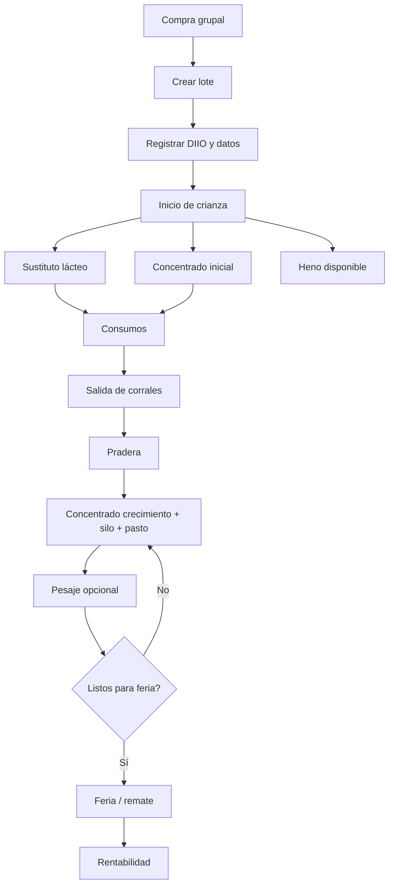
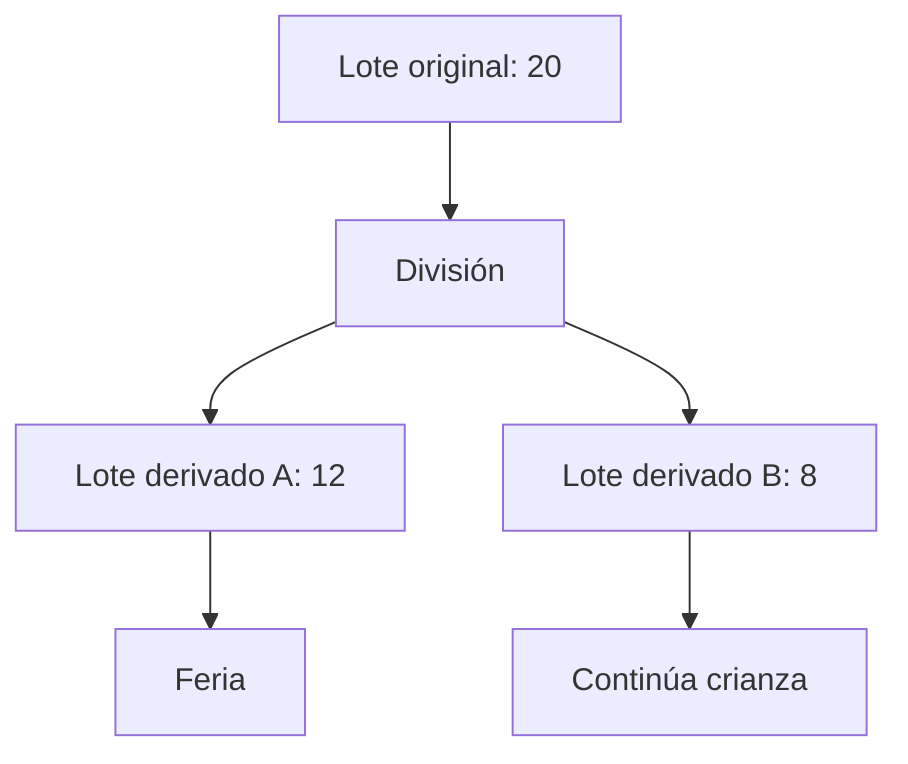
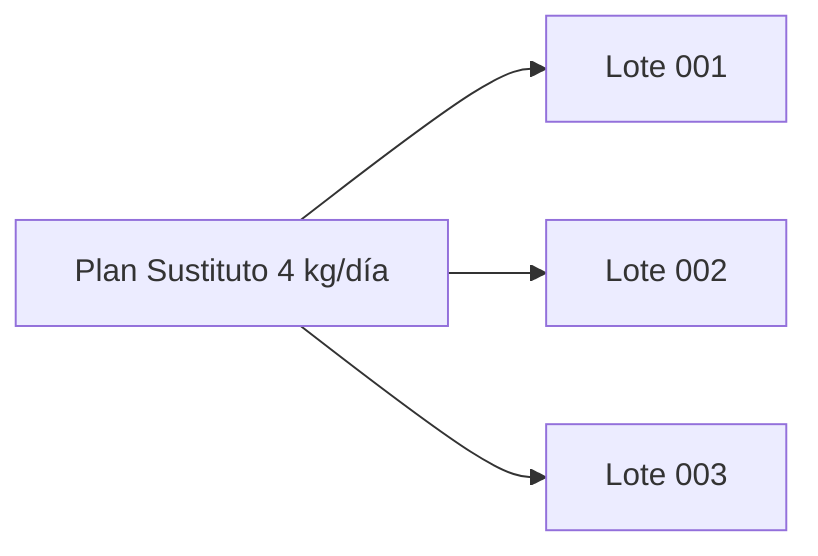
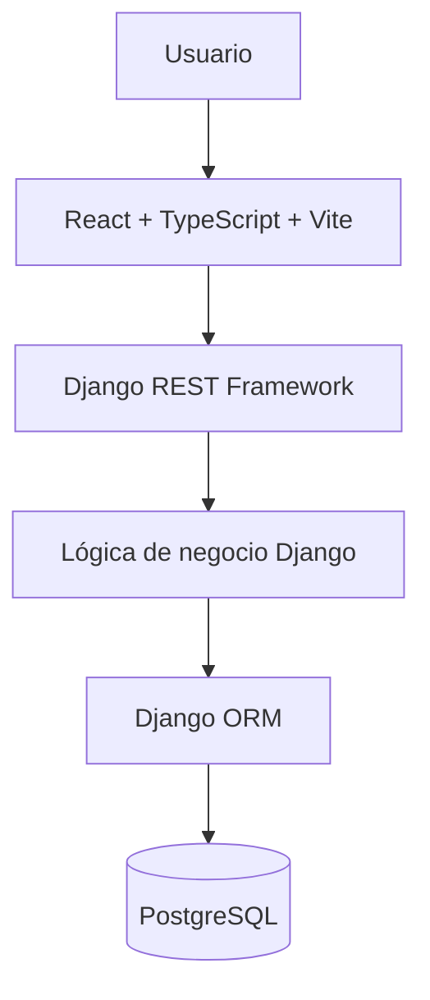
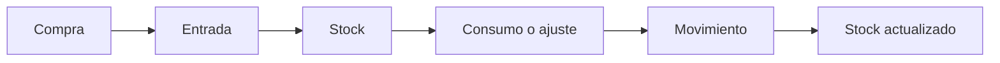
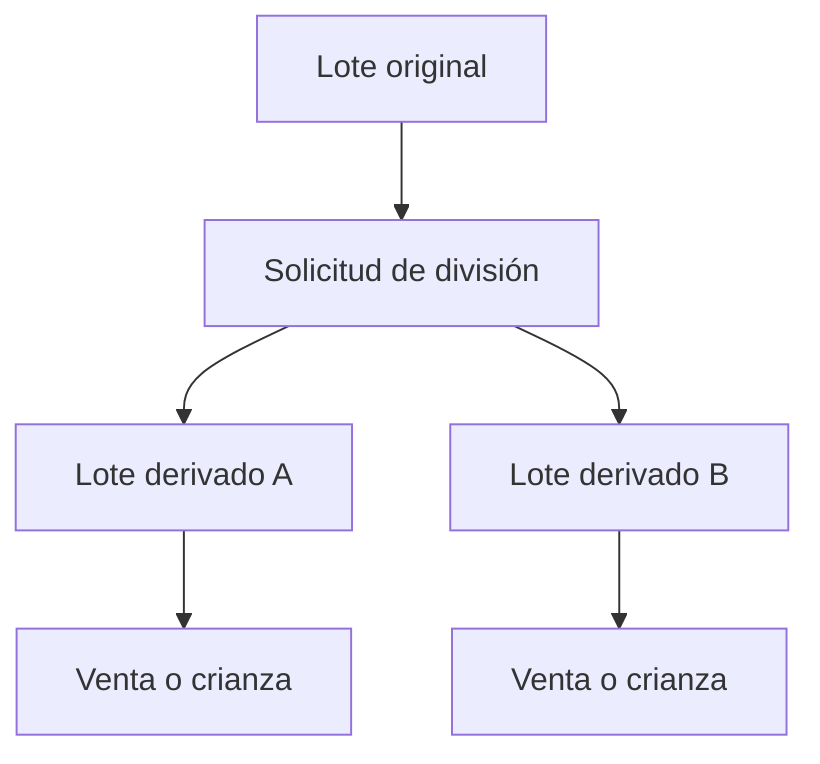
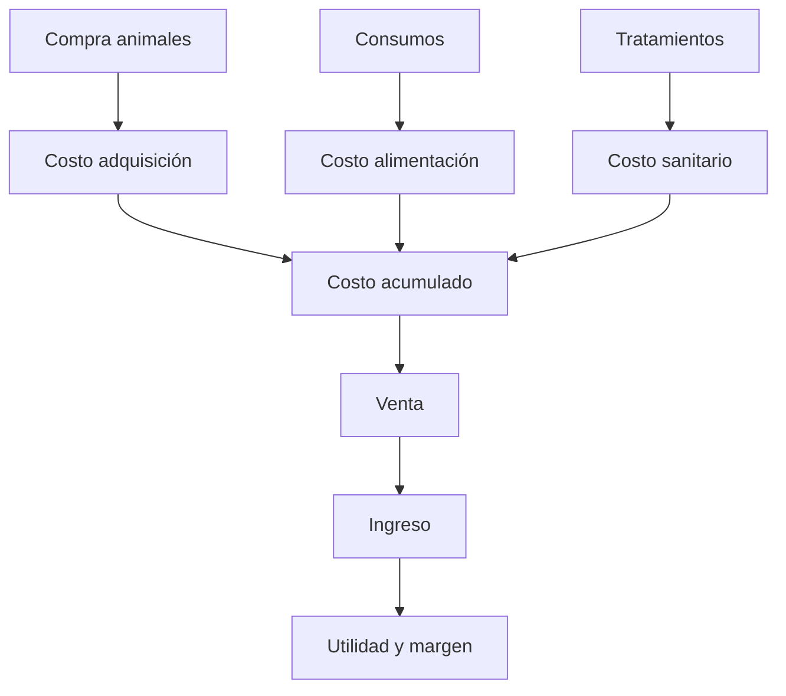
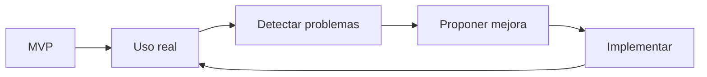

# SGIC-Terneros
## Sistema de Gestión de Crianza, Inventario y Costos

> **Documentación funcional y técnica del MVP**  
> **Versión:** 1.5  
> **Fecha:** agosto de 2026  
> **Estado:** base aprobada para iniciar implementación  
> **Stack:** React + TypeScript + Vite · Django + DRF · PostgreSQL

---

## Índice

1. [Descripción general](#1-descripción-general)
2. [Contexto y problemática](#2-contexto-y-problemática)
3. [Objetivos](#3-objetivos)
4. [Alcance del MVP](#4-alcance-del-mvp)
5. [Conceptos del negocio](#5-conceptos-del-negocio)
6. [Reglas de negocio](#6-reglas-de-negocio)
7. [Ciclo de crianza](#7-ciclo-de-crianza)
8. [Animales, DIIO y SIPEC](#8-animales-diio-y-sipec)
9. [Lotes](#9-lotes)
10. [Compras de animales](#10-compras-de-animales)
11. [Alimentación y planes de consumo](#11-alimentación-y-planes-de-consumo)
12. [Inventario](#12-inventario)
13. [Compras de insumos](#13-compras-de-insumos)
14. [Consumos](#14-consumos)
15. [Sanidad](#15-sanidad)
16. [Pesajes](#16-pesajes)
17. [Gastos](#17-gastos)
18. [Costos y rentabilidad](#18-costos-y-rentabilidad)
19. [Ventas](#19-ventas)
20. [Usuarios y permisos](#20-usuarios-y-permisos)
21. [Dashboard](#21-dashboard)
22. [Requerimientos funcionales](#22-requerimientos-funcionales)
23. [Requerimientos no funcionales](#23-requerimientos-no-funcionales)
24. [Modelo de datos](#24-modelo-de-datos)
25. [Diccionario de datos](#25-diccionario-de-datos)
26. [Diagramas Mermaid](#26-diagramas-mermaid)
27. [Arquitectura](#27-arquitectura)
28. [API REST](#28-api-rest)
29. [Seguridad, auditoría y respaldos](#29-seguridad-auditoría-y-respaldos)
30. [Criterios de aceptación](#30-criterios-de-aceptación)
31. [Plan de implementación](#31-plan-de-implementación)
32. [MVP y mejora continua](#32-mvp-y-mejora-continua)
33. [Funcionalidades futuras](#33-funcionalidades-futuras)
34. [Matriz de trazabilidad](#34-matriz-de-trazabilidad)
35. [Glosario](#35-glosario)

---

# 1. Descripción general

SGIC-Terneros será una aplicación web para gestionar la crianza de terneros, controlar el inventario de insumos y conocer los costos y resultados económicos de los lotes.

El sistema se implementará primero dentro de la empresa, en la red local. La primera versión debe ser sencilla y funcional para poder probarla con la operación real. Las mejoras se incorporarán después de observar el uso cotidiano.

El sistema conectará:

```text
ANIMALES
   ↓
LOTES
   ↓
ALIMENTACIÓN / SANIDAD / PESAJES
   ↓
CONSUMOS
   ↓
INVENTARIO
   ↓
COSTOS
   ↓
FERIA / VENTA
   ↓
RENTABILIDAD
```

> **Principio:** el sistema debe registrar los hechos reales de la empresa y automatizar solamente aquello que aporte valor y no obligue a cambiar innecesariamente la forma de trabajo.

SGIC no reemplaza la contabilidad tributaria. Su objetivo es entregar control operativo, trazabilidad, inventario, costos y rentabilidad de la crianza.

---

# 2. Contexto y problemática

Los terneros se compran normalmente en grupos. Los animales de un mismo grupo suelen tener edades similares y permanecen juntos durante la crianza. Al llegar al momento de venta, el grupo se lleva normalmente a feria para ser rematado.

Actualmente gran parte de las decisiones se toman mediante observación directa. Esto es especialmente importante en alimentación: un lote puede adaptarse al sustituto en pocos días mientras otro puede tardar una semana. Por eso no es conveniente convertir el sistema en una receta rígida que intente decidir automáticamente cuánto debe comer cada lote.

Los principales problemas que SGIC debe resolver son:

- conocer cuántos animales y lotes están activos;
- mantener identificados los animales mediante DIIO;
- conocer el origen de cada lote;
- saber cuánto alimento e insumos quedan;
- registrar compras y consumos sin duplicar trabajo;
- mantener un historial de movimientos;
- conocer cuánto ha costado mantener un lote;
- registrar gastos generales por separado;
- registrar la venta en feria;
- calcular utilidad y margen;
- disponer de información suficiente para mejorar posteriormente el manejo.

---

# 3. Objetivos

## 3.1 Objetivo general

Desarrollar una aplicación web que permita controlar animales, lotes, inventario, compras, planes de consumo, consumos, sanidad, gastos, ventas y rentabilidad.

## 3.2 Objetivos específicos

1. Registrar animales mediante DIIO.
2. Registrar los datos disponibles desde SIPEC.
3. Crear lotes a partir de compras grupales.
4. Mantener trazabilidad de lotes y animales.
5. Controlar el inventario de alimentos, forraje y medicamentos.
6. Registrar compras de insumos y actualizar el stock automáticamente.
7. Crear planes de consumo reutilizables.
8. Asociar y desasociar planes manualmente de los lotes.
9. Registrar consumos reales cuando sea necesario.
10. Permitir consumos habituales generados a partir de planes.
11. Registrar tratamientos sanitarios de forma sencilla.
12. Permitir pesajes opcionales.
13. Registrar gastos generales y gastos imputables a lotes.
14. Registrar ventas realizadas mediante feria/remate.
15. Calcular costos acumulados, utilidad y margen.
16. Mostrar un dashboard inicial con información operativa útil.

---

# 4. Alcance del MVP

El MVP debe priorizar funcionamiento y facilidad de uso por sobre una gran cantidad de funciones.

| Módulo | MVP |
|---|:---:|
| Usuarios | Sí |
| Animales / DIIO | Sí |
| Lotes | Sí |
| Compras de animales | Sí |
| Inventario | Sí |
| Compras de insumos | Sí |
| Planes de consumo | Sí |
| Consumos | Sí |
| Sanidad | Sí, simple |
| Pesajes | Sí, opcional |
| Gastos | Sí |
| Costos | Sí |
| Ventas | Sí |
| Rentabilidad | Sí |
| Dashboard | Sí, básico |
| Integración automática con SIPEC | No |
| RFID / QR | No |
| IA / predicciones | No |
| Contabilidad tributaria | No |
| Aplicación móvil nativa | No |
| Reportes avanzados | No |

La aplicación se probará primero con la operación real de la empresa antes de ampliar su alcance.

---

# 5. Conceptos del negocio

## 5.1 Animal

Es el bovino individual. Su identificador principal dentro de SGIC será el **DIIO**.

## 5.2 DIIO

Identificador oficial individual del bovino, normalmente presente en el arete del animal. Es el dato que debe utilizarse como identificación principal en SGIC.

## 5.3 SIPEC

Sistema externo utilizado para mantener la trazabilidad oficial de los animales. SGIC no dependerá de una integración automática con SIPEC en el MVP.

## 5.4 Lote

Grupo de animales comprado y manejado conjuntamente. Una compra grupal normalmente origina un lote.

Ejemplo:

```text
Compra de 20 terneros
        ↓
Lote L-2026-001
        ↓
20 animales
```

## 5.5 Plan de consumo

Es una configuración de consumo habitual. No es una receta rígida ni una predicción automática.

Ejemplo:

```text
Plan Sustituto 4 kg/día
Producto: Sustituto lácteo
Cantidad habitual: 4 kg/día
```

El plan existe principalmente para evitar que el operador tenga que registrar repetidamente un consumo que se mantiene durante un período.

## 5.6 Consumo real

Es una cantidad efectivamente consumida que puede registrarse cuando difiere del comportamiento habitual o cuando se necesita mayor precisión.

---

# 6. Reglas de negocio

## 6.1 Animales

| ID | Regla |
|---|---|
| RN-AN-01 | El DIIO es el identificador principal y debe ser único. |
| RN-AN-02 | Un animal pertenece a un lote operativo. |
| RN-AN-03 | No existe traslado libre de animales entre lotes. |
| RN-AN-04 | El costo de adquisición del animal se conserva individualmente. |
| RN-AN-05 | El peso es opcional. |
| RN-AN-06 | Un animal fallecido no puede venderse. |
| RN-AN-07 | Un animal vendido no vuelve a activo mediante una edición normal. |
| RN-AN-08 | Los registros históricos importantes no se eliminan físicamente. |

## 6.2 Lotes

| ID | Regla |
|---|---|
| RN-LO-01 | Una compra grupal normalmente genera un lote. |
| RN-LO-02 | Los animales del lote conservan su origen. |
| RN-LO-03 | Un lote puede disminuir por muerte. |
| RN-LO-04 | Una incorporación posterior es excepcional y debe quedar registrada. |
| RN-LO-05 | Un animal incorporado conserva su costo original. |
| RN-LO-06 | Un lote puede dividirse. |
| RN-LO-07 | Una división genera lotes derivados y conserva la relación histórica. |
| RN-LO-08 | Los animales no se venden individualmente como operación normal. |

## 6.3 Inventario

| ID | Regla |
|---|---|
| RN-IN-01 | Todos los productos tienen inventario. |
| RN-IN-02 | Las variaciones de stock se registran como movimientos. |
| RN-IN-03 | No se permite stock negativo en condiciones normales. |
| RN-IN-04 | Las compras generan entradas. |
| RN-IN-05 | Los consumos generan salidas. |
| RN-IN-06 | Los ajustes quedan registrados. |
| RN-IN-07 | El stock puede mostrarse en unidad base y presentación comercial. |

## 6.4 Alimentación

| ID | Regla |
|---|---|
| RN-AL-01 | Los planes son independientes de los lotes. |
| RN-AL-02 | Un plan puede reutilizarse en varios lotes. |
| RN-AL-03 | Un lote puede tener planes diferentes para productos distintos. |
| RN-AL-04 | La asociación de un plan permanece hasta que el usuario la finaliza o modifica. |
| RN-AL-05 | La cantidad del plan representa consumo habitual. |
| RN-AL-06 | El operador puede cambiar la cantidad según la situación real. |
| RN-AL-07 | Un consumo excepcional puede registrarse sin modificar el plan habitual. |
| RN-AL-08 | El sistema no cambia automáticamente un plan por edad. |

## 6.5 Costos y gastos

| ID | Regla |
|---|---|
| RN-CT-01 | El precio de adquisición de los animales forma parte del costo. |
| RN-CT-02 | Los consumos asociados a un lote forman parte de su costo. |
| RN-CT-03 | Los medicamentos asociados a crianza pueden formar parte del costo. |
| RN-CT-04 | Los gastos generales se mantienen separados. |
| RN-CT-05 | El MVP prioriza costos acumulados y generales sobre una distribución excesivamente detallada. |

## 6.6 Ventas

| ID | Regla |
|---|---|
| RN-VE-01 | La venta normal ocurre mediante feria/remate. |
| RN-VE-02 | La operación se registra como una venta de un grupo/lote. |
| RN-VE-03 | El precio de referencia es por kg. |
| RN-VE-04 | El peso de venta es opcional. |
| RN-VE-05 | Si un lote se divide, cada grupo derivado puede venderse por separado. |
| RN-VE-06 | La venta confirmada cierra el grupo vendido. |

---

# 7. Ciclo de crianza

El manejo real puede representarse de forma aproximada así:



## 7.1 Etapas de referencia

| Etapa | Manejo habitual |
|---|---|
| Compra | Terneros de aproximadamente una semana; edad aproximada |
| Primeros días | Adaptación al sustituto; algunos consumen menos |
| Hasta aprox. 2 meses | Sustituto + concentrado inicial + heno disponible |
| Desde aprox. 3 meses | Pradera y reducción progresiva de leche |
| 60–120 días | Concentrado de crecimiento |
| Etapa posterior | Pradera + pasto + silo + concentrado |
| 6–7 meses o más | Evaluación visual y eventualmente pesaje |
| Feria | Remate, normalmente valorizado por kg |

Estas etapas son referencias de manejo, no reglas automáticas del software.

---

# 8. Animales, DIIO y SIPEC

## 8.1 Datos del animal

| Campo | Obligatorio | Descripción |
|---|:---:|---|
| DIIO | Sí | Identificador oficial |
| Raza | Sí | Raza informada |
| Sexo | Sí | Sexo |
| Fecha de nacimiento | No | Dato disponible desde SIPEC |
| Edad aproximada | Sí | Edad estimada al ingreso |
| Fecha de adquisición | Sí | Fecha de compra |
| Precio de adquisición | Sí | Precio pagado por el animal |
| Peso de ingreso | No | Peso opcional |
| Lote | Sí | Lote operativo |
| Estado | Sí | Activo / vendido / fallecido |
| Observaciones | No | Información adicional |

## 8.2 SIPEC

El sistema almacenará la información necesaria para el control interno, pero no intentará sustituir SIPEC.

```text
SIPEC
  ↓
Datos disponibles al comprar
  ↓
SGIC
  ↓
Control interno
```

Una integración automática podrá evaluarse en una etapa posterior si existe una vía técnica y autorizada para realizarla.

---

# 9. Lotes

## 9.1 Formación

Una compra de animales genera normalmente un lote.

```text
CompraAnimal #001
20 animales
$110.000 c/u
        ↓
Lote L-2026-001
20 animales
```

## 9.2 Muerte

Si un lote de 10 pierde un animal:

```text
Cantidad original: 10
Activos: 9
Fallecido: 1
```

El lote operativo queda con 9 animales, pero el historial conserva la muerte.

## 9.3 Incorporación excepcional

Puede incorporarse un animal de forma excepcional si es compatible con el lote.

```text
Lote 001
15 animales
+
1 animal comprado posteriormente
=
16 animales
```

El nuevo animal conserva su propio precio de adquisición.

## 9.4 División

Si de 20 animales 12 están listos para feria y 8 necesitan más tiempo:



La división no significa que los animales cambien arbitrariamente de lote. Es una operación histórica controlada que crea grupos derivados.

---

# 10. Compras de animales

La operación de compra se separa de la ficha individual:

```text
CompraAnimal
    ↓
DetalleCompraAnimal
    ↓
Animal
    ↓
Lote
```

## 10.1 Compra

| Campo | Descripción |
|---|---|
| Fecha | Fecha de adquisición |
| Proveedor/vendedor | Si se conoce |
| Total | Total pagado |
| Observaciones | Notas |

## 10.2 Detalle

| Campo | Descripción |
|---|---|
| Animal | Animal adquirido |
| Precio de adquisición | Costo individual |
| Peso de compra | Opcional |

La compra de animales no depende del peso. El precio habitual se registra por animal.

---

# 11. Alimentación y planes de consumo

## 11.1 Enfoque definitivo

Los planes no serán recetas automáticas basadas estrictamente en edad.

La razón es operacional: los lotes se comportan de forma diferente. Algunos terneros se adaptan rápidamente al sustituto y otros necesitan varios días. El operador puede aumentar o disminuir la cantidad según observación.

Por ello:

> **Un plan representa un consumo habitual mientras permanezca asociado al lote.**

## 11.2 Ejemplo

```text
Lote 001

Plan de sustituto
4 kg/día
Activo
```

Mientras esté activo, el sistema puede utilizar 4 kg/día como referencia para generar o registrar el consumo habitual.

Si se decide aumentar:

```text
4 kg/día → 4,5 kg/día
```

Si un día se consumen excepcionalmente 5 kg:

```text
Plan habitual: 4 kg
Consumo excepcional: 5 kg
```

El consumo excepcional no obliga a cambiar el plan.

## 11.3 Planes reutilizables



## 11.4 Productos

- Sustituto lácteo.
- Concentrado inicial.
- Concentrado de crecimiento.
- Silo.
- Heno/fardo.
- Paja.

## 11.5 Sustituto lácteo

La unidad principal es el kg de polvo.

Conversión informativa:

```text
125 g = 1 L
0,125 kg = 1 L
1 kg ≈ 8 L
```

Ejemplo:

```text
4 kg × 8 L/kg = 32 L
```

Los litros son solamente información complementaria. El inventario y los planes utilizan kg.

---

# 12. Inventario

Todos los productos tienen inventario, pero no todos tienen el mismo nivel de automatización.

## 12.1 Productos principales

| Producto | Unidad base | Control |
|---|---|---|
| Sustituto lácteo | kg | Automático |
| Concentrado inicial | kg | Automático |
| Concentrado crecimiento | kg | Automático |
| Silo | bolo | Manual |
| Heno/fardo | unidad | Manual |
| Paja | unidad/bolo | Manual |
| Medicamentos | unidad/presentación | Manual |

## 12.2 Presentaciones

Ejemplo:

```text
Sustituto lácteo
Stock: 125 kg
Presentación: saco de 25 kg
Equivalente: 5 sacos
```

La unidad base permite realizar cálculos y movimientos consistentes.

## 12.3 Stock

```text
Stock actual = entradas - salidas + ajustes
```

El sistema conservará el historial de movimientos.

---

# 13. Compras de insumos

Una compra puede contener varios productos.

```text
Compra #125

Sustituto lácteo       10 sacos
Concentrado inicial     5 sacos
Heno                   20 fardos
```

Al confirmar:

1. se registra la compra;
2. se registran sus detalles;
3. las presentaciones se convierten a unidad base;
4. se genera la entrada de inventario;
5. se actualiza el stock;
6. se actualiza la valorización del inventario.

En el MVP no se registrará el estado de pago ni se gestionarán cuentas por pagar.

El transporte no será un componente obligatorio de la compra.

---

# 14. Consumos

## 14.1 Consumo asociado a lote

```text
Lote 001
Sustituto lácteo
4 kg
```

El sistema registra:

```text
Consumo
   ↓
Salida de inventario
   ↓
Costo
   ↓
Lote
```

## 14.2 Consumo habitual mediante plan

Un plan permite evitar registrar todos los días el mismo consumo.

```text
Plan activo
4 kg/día
       ↓
Consumo habitual
       ↓
Descuento de inventario
```

El sistema debe conservar el período durante el cual el plan estuvo asociado al lote.

## 14.3 Consumo excepcional

```text
Plan: 4 kg/día
Consumo real: 5 kg
```

El usuario puede registrar la excepción sin cambiar la configuración habitual.

## 14.4 Concentrado

No se obligará a distribuir matemáticamente cada saco entre lotes si el manejo real no lo permite.

Por ejemplo:

```text
Salida general
Concentrado crecimiento
25 kg
```

La asociación a lote se realizará cuando exista información suficientemente confiable para hacerlo.

---

# 15. Sanidad

El módulo será simple y práctico.

Los medicamentos pueden registrarse como productos de inventario, pero los tratamientos no intentarán diagnosticar automáticamente.

Ejemplos habituales:

```text
Diarrea
→ Azobetril

Neumonía
→ Licuamicina
```

También pueden registrarse vitaminas y antiparasitarios.

## Datos mínimos

| Campo | Descripción |
|---|---|
| Animal | Animal tratado |
| Fecha | Fecha |
| Medicamento | Producto utilizado |
| Cantidad | Cuando se conozca |
| Motivo | Motivo observado |
| Observaciones | Detalles |

Los tratamientos podrán generar una salida de inventario cuando exista una cantidad registrada.

---

# 16. Pesajes

El pesaje será opcional en todo el sistema.

No se exigirá pesar animales al comprar.

Puede utilizarse durante la crianza o antes de feria.

Ejemplo:

```text
DIIO X

10/09 → 80 kg
10/10 → 120 kg
10/11 → 165 kg
10/12 → 200 kg
```

El sistema conservará el historial y podrá calcular crecimiento cuando existan suficientes datos.

---

# 17. Gastos

Se diferencian los gastos que forman parte de la crianza de los gastos generales.

## 17.1 Gastos imputables al lote

Ejemplos:

- alimentación;
- medicamentos;
- otros costos directamente relacionados con un lote.

## 17.2 Gastos generales

Ejemplos:

- petróleo;
- electricidad;
- agua;
- madera;
- arriendo de maquinaria;
- otros gastos generales.

Ejemplo:

```text
Nombre: Compra de madera
Detalle: Madera para reparación de corral
Monto: $2.000
Tipo: Gasto general
```

Los gastos generales se muestran en la gestión económica, pero no afectan directamente la rentabilidad productiva de un lote.

---

# 18. Costos y rentabilidad

## 18.1 Principio

El objetivo del MVP es responder:

> **¿Cuánto costó criar este lote y cuánto dinero produjo?**

No se busca inicialmente una contabilidad de costos excesivamente detallada por cada kg o cada insumo.

## 18.2 Costo acumulado

```text
Costo adquisición animales
+ alimentación
+ medicamentos
+ otros costos imputables
= costo del lote
```

## 18.3 Rentabilidad

```text
Venta
- costo reconocido
= utilidad
```

Indicadores:

- costo total del lote;
- venta total;
- utilidad;
- margen porcentual;
- costo promedio por animal;
- utilidad promedio por animal;
- peso total vendido, si existe;
- precio promedio por kg;
- costo por kg vendido, si existen datos suficientes.

## 18.4 Ejemplo

```text
Lote: 20 animales

Compra                 $2.200.000
Alimentación              $850.000
Medicamentos                $45.000
Otros costos                $50.000
-----------------------------------
Costo total             $3.145.000

Venta                   $4.100.000
-----------------------------------
Utilidad                  $955.000
```

## 18.5 Costo por animal

Como indicador general:

```text
Costo promedio por animal
= costo acumulado / animales considerados
```

No se pretende que este valor represente necesariamente el costo exacto de cada individuo cuando los consumos fueron grupales.

## 18.6 PMP de inventario

Para valorizar inventario se utilizará inicialmente Precio Medio Ponderado.

```text
PMP nuevo =
((stock actual × PMP anterior) + (cantidad comprada × precio))
/
(stock actual + cantidad comprada)
```

El costo aplicado al consumo se conserva en el movimiento para mantener el historial.

---

# 19. Ventas

Los animales se venden mediante feria/remate.

## 19.1 Flujo

```text
Lote / lote derivado
       ↓
Feria
       ↓
Remate
       ↓
Precio por kg
       ↓
Venta
```

El precio de referencia habitual es por kg. Como referencia del negocio, una venta buena puede superar $3.000/kg y valores cercanos a $2.800/kg representan escenarios menos favorables. Estos valores son informativos y no deben codificarse como reglas.

## 19.2 Datos

| Campo | Obligatorio | Descripción |
|---|:---:|---|
| Fecha | Sí | Fecha del remate |
| Lote/grupo | Sí | Grupo vendido |
| Comprador/rematador | No | Si se conoce |
| Peso total | No | Peso disponible |
| Precio por kg | No | Precio de remate |
| Total venta | Sí | Ingreso |
| Documento | No | Factura u otro documento |
| Observaciones | No | Notas |

## 19.3 División antes de venta

```text
Lote original: 20
       ↓
12 → feria
8 → continúan
```

Los 12 pueden venderse como un lote derivado y los 8 permanecen activos.

---

# 20. Usuarios y permisos

Se utilizarán dos roles iniciales.

| Rol | Acceso |
|---|---|
| Administrador | Configuración y acceso completo |
| Operador | Operación diaria |

## Administrador

- usuarios;
- productos y categorías;
- unidades y presentaciones;
- ajustes de inventario;
- planes;
- consultas y configuración.

## Operador

- animales;
- lotes;
- consumos;
- cambios de planes;
- inventario operativo;
- tratamientos;
- pesajes;
- ventas.

Las operaciones importantes no deben borrarse. Se utilizarán anulaciones, reversas o ajustes trazables.

---

# 21. Dashboard

El dashboard inicial debe ser simple.

## 21.1 Indicadores principales

```text
Animales activos
Lotes activos
Valor del inventario
```

## 21.2 Stock relevante

```text
Sustituto lácteo
├── kg disponibles
└── sacos equivalentes

Concentrado inicial
├── kg disponibles
└── sacos equivalentes

Concentrado crecimiento
├── kg disponibles
└── sacos equivalentes
```

## 21.3 Evolución posterior

Después de probar el MVP podrán agregarse:

- lotes próximos a feria;
- mortalidad;
- costos;
- ventas;
- utilidad;
- gráficos;
- alertas.

El diseño visual puede evolucionar durante la implementación según el uso real.

---

# 22. Requerimientos funcionales

| ID | Requerimiento |
|---|---|
| RF-01 | Autenticar usuarios. |
| RF-02 | Registrar animales mediante DIIO. |
| RF-03 | Registrar raza, sexo, nacimiento y edad aproximada. |
| RF-04 | Crear lotes. |
| RF-05 | Registrar compras grupales de animales. |
| RF-06 | Conservar costo individual de adquisición. |
| RF-07 | Registrar muertes. |
| RF-08 | Dividir lotes y crear lotes derivados. |
| RF-09 | Registrar incorporaciones excepcionales. |
| RF-10 | Crear productos y categorías. |
| RF-11 | Definir unidades y presentaciones. |
| RF-12 | Registrar compras de insumos. |
| RF-13 | Actualizar stock automáticamente. |
| RF-14 | Registrar ajustes manuales. |
| RF-15 | Crear planes de consumo reutilizables. |
| RF-16 | Asociar planes a lotes. |
| RF-17 | Modificar y desasociar planes. |
| RF-18 | Generar/registrar consumos habituales. |
| RF-19 | Registrar consumos excepcionales. |
| RF-20 | Registrar tratamientos. |
| RF-21 | Registrar pesajes opcionales. |
| RF-22 | Registrar gastos generales. |
| RF-23 | Registrar gastos asociados a lotes. |
| RF-24 | Registrar ventas por grupo/lote. |
| RF-25 | Calcular costos. |
| RF-26 | Calcular utilidad y margen. |
| RF-27 | Mostrar dashboard básico. |
| RF-28 | Mantener historial de movimientos críticos. |

---

# 23. Requerimientos no funcionales

| ID | Requisito |
|---|---|
| RNF-01 | Autenticación segura mediante Django. |
| RNF-02 | Permisos validados en backend. |
| RNF-03 | Secretos fuera del repositorio. |
| RNF-04 | Operaciones críticas transaccionales. |
| RNF-05 | Respaldos periódicos de PostgreSQL. |
| RNF-06 | Funcionamiento inicial en red local. |
| RNF-07 | Posibilidad de incorporar acceso remoto posteriormente. |
| RNF-08 | Uso desde PC y móviles mediante navegador. |
| RNF-09 | Código modular y mantenible. |
| RNF-10 | Historial de operaciones importantes. |

---

# 24. Modelo de datos

## 24.1 Módulos

| Módulo | Modelos |
|---|---|
| Ganadería | Animal, Raza, Lote, PesoAnimal |
| Compras animales | CompraAnimal, DetalleCompraAnimal |
| Inventario | CategoriaProducto, Producto, UnidadMedida, PresentacionProducto, ConversionProducto, MovimientoInventario |
| Compras insumos | CompraInsumo, DetalleCompraInsumo |
| Alimentación | PlanConsumo, DetallePlanConsumo, AsignacionPlanLote |
| Consumos | Consumo, DetalleConsumo |
| Sanidad | Tratamiento |
| Gastos | CategoriaGasto, Gasto |
| Ventas | Venta, DetalleVenta |
| Seguridad | Usuario Django, RegistroAuditoria |

## 24.2 Relación conceptual

```text
Proveedor
 ├── CompraAnimal
 │      └── DetalleCompraAnimal ── Animal ── Lote
 │
 └── CompraInsumo
        └── DetalleCompraInsumo ── Producto
                                     └── MovimientoInventario

Lote
 ├── Animal
 ├── Consumo ── DetalleConsumo ── Producto
 ├── Gasto
 ├── AsignacionPlanLote ── PlanConsumo
 └── DetalleVenta ── Venta

Animal
 ├── PesoAnimal
 └── Tratamiento ── Producto
```

## 24.3 Decisión de diseño importante

Los costos de adquisición se almacenan en el animal porque un animal incorporado posteriormente puede tener un precio distinto al resto del lote.

Los costos de alimentación se mantienen principalmente como costos acumulados del lote. Esto evita inventar una precisión que la operación real no posee.

---

# 25. Diccionario de datos

## 25.1 `lote`

| Campo | Tipo | Clave | Descripción |
|---|---|---|---|
| id | BIGINT | PK | Identificador |
| codigo | VARCHAR(30) | UNIQUE | Código |
| lote_origen_id | BIGINT | FK/NULL | Lote padre cuando es derivado |
| fecha_ingreso | DATE | | Fecha |
| cantidad_original | INT | | Cantidad inicial |
| cantidad_actual | INT | | Activos actuales |
| estado | VARCHAR(20) | | ACTIVO/CERRADO |
| observaciones | TEXT | | Notas |
| creado_el | TIMESTAMP | | Fecha de creación |

## 25.2 `animal`

| Campo | Tipo | Clave | Descripción |
|---|---|---|---|
| id | BIGINT | PK | Identificador interno |
| diio | VARCHAR(30) | UNIQUE | Identificador oficial |
| lote_id | BIGINT | FK | Lote |
| raza_id | BIGINT | FK | Raza |
| sexo | VARCHAR(10) | | Sexo |
| fecha_nacimiento | DATE | NULL | Fecha disponible |
| edad_aproximada_dias | INT | | Edad al ingreso |
| fecha_adquisicion | DATE | | Compra |
| precio_adquisicion | DECIMAL(12,2) | | Costo individual |
| peso_ingreso_kg | DECIMAL(8,2) | NULL | Opcional |
| estado | VARCHAR(20) | | ACTIVO/VENDIDO/FALLECIDO |
| observaciones | TEXT | | Notas |

## 25.3 `raza`

| Campo | Tipo | Clave | Descripción |
|---|---|---|---|
| id | BIGINT | PK | Identificador |
| nombre | VARCHAR(80) | UNIQUE | Raza |

## 25.4 `peso_animal`

| Campo | Tipo | Clave | Descripción |
|---|---|---|---|
| id | BIGINT | PK | Identificador |
| animal_id | BIGINT | FK | Animal |
| fecha | DATE | | Fecha |
| peso_kg | DECIMAL(8,2) | | Peso |
| observaciones | TEXT | | Notas |

## 25.5 `proveedor`

| Campo | Tipo | Clave | Descripción |
|---|---|---|---|
| id | BIGINT | PK | Identificador |
| nombre | VARCHAR(150) | | Nombre |
| rut | VARCHAR(20) | | Opcional |
| telefono | VARCHAR(30) | | Contacto |
| email | VARCHAR(120) | | Contacto |
| direccion | VARCHAR(200) | | Dirección |
| activo | BOOLEAN | | Vigencia |

## 25.6 `categoria_producto`

| Campo | Tipo | Clave | Descripción |
|---|---|---|---|
| id | BIGINT | PK | Identificador |
| nombre | VARCHAR(80) | UNIQUE | Categoría |
| descripcion | TEXT | | Descripción |
| activo | BOOLEAN | | Vigencia |

## 25.7 `unidad_medida`

| Campo | Tipo | Clave | Descripción |
|---|---|---|---|
| id | BIGINT | PK | Identificador |
| codigo | VARCHAR(20) | UNIQUE | KG, UN, BOLO |
| nombre | VARCHAR(50) | | Nombre |
| tipo | VARCHAR(30) | | Peso/unidad |
| decimales | INT | | Precisión |

## 25.8 `producto`

| Campo | Tipo | Clave | Descripción |
|---|---|---|---|
| id | BIGINT | PK | Identificador |
| nombre | VARCHAR(120) | | Producto |
| categoria_id | BIGINT | FK | Categoría |
| unidad_base_id | BIGINT | FK | Unidad |
| stock_actual | DECIMAL(12,3) | | Stock |
| stock_minimo | DECIMAL(12,3) | | Umbral |
| costo_promedio | DECIMAL(12,2) | | PMP |
| activo | BOOLEAN | | Vigencia |
| observaciones | TEXT | | Notas |

## 25.9 `presentacion_producto`

| Campo | Tipo | Clave | Descripción |
|---|---|---|---|
| id | BIGINT | PK | Identificador |
| producto_id | BIGINT | FK | Producto |
| nombre | VARCHAR(80) | | Saco 25 kg, fardo, etc. |
| cantidad_base | DECIMAL(12,3) | | Contenido |
| unidad_base_id | BIGINT | FK | Unidad |
| activa | BOOLEAN | | Vigencia |

## 25.10 `conversion_producto`

| Campo | Tipo | Clave | Descripción |
|---|---|---|---|
| id | BIGINT | PK | Identificador |
| producto_id | BIGINT | FK | Producto |
| cantidad_origen | DECIMAL(12,4) | | Cantidad origen |
| unidad_origen_id | BIGINT | FK | Unidad |
| cantidad_destino | DECIMAL(12,4) | | Cantidad destino |
| unidad_destino_id | BIGINT | FK | Unidad |
| activa | BOOLEAN | | Vigencia |

Ejemplo: `0,125 kg → 1 L`.

## 25.11 `movimiento_inventario`

| Campo | Tipo | Clave | Descripción |
|---|---|---|---|
| id | BIGINT | PK | Identificador |
| producto_id | BIGINT | FK | Producto |
| tipo | VARCHAR(30) | | ENTRADA/SALIDA/AJUSTE |
| cantidad | DECIMAL(12,3) | | Cantidad |
| costo_unitario | DECIMAL(12,2) | | Costo aplicado |
| costo_total | DECIMAL(12,2) | | Total |
| fecha_hora | TIMESTAMP | | Momento |
| usuario_id | BIGINT | FK | Responsable |
| referencia_tipo | VARCHAR(50) | | Compra/consumo/ajuste |
| referencia_id | BIGINT | NULL | Registro relacionado |
| observaciones | TEXT | | Motivo |

## 25.12 `compra_insumo`

| Campo | Tipo | Clave | Descripción |
|---|---|---|---|
| id | BIGINT | PK | Identificador |
| proveedor_id | BIGINT | FK | Proveedor |
| fecha | DATE | | Fecha |
| numero_documento | VARCHAR(50) | NULL | Factura/guía |
| estado | VARCHAR(20) | | BORRADOR/CONFIRMADA/ANULADA |
| total | DECIMAL(12,2) | | Total |
| observaciones | TEXT | | Notas |

## 25.13 `detalle_compra_insumo`

| Campo | Tipo | Clave | Descripción |
|---|---|---|---|
| id | BIGINT | PK | Identificador |
| compra_id | BIGINT | FK | Compra |
| producto_id | BIGINT | FK | Producto |
| presentacion_id | BIGINT | FK/NULL | Presentación |
| cantidad | DECIMAL(12,3) | | Presentaciones |
| cantidad_base | DECIMAL(12,3) | | Unidad base |
| precio_unitario | DECIMAL(12,2) | | Precio |
| subtotal | DECIMAL(12,2) | | Subtotal |

## 25.14 `plan_consumo`

| Campo | Tipo | Clave | Descripción |
|---|---|---|---|
| id | BIGINT | PK | Identificador |
| nombre | VARCHAR(100) | | Nombre |
| descripcion | TEXT | | Descripción |
| activo | BOOLEAN | | Disponible |
| observaciones | TEXT | | Notas |

## 25.15 `detalle_plan_consumo`

| Campo | Tipo | Clave | Descripción |
|---|---|---|---|
| id | BIGINT | PK | Identificador |
| plan_id | BIGINT | FK | Plan |
| producto_id | BIGINT | FK | Producto |
| cantidad_diaria | DECIMAL(12,3) | | Cantidad habitual |
| unidad_id | BIGINT | FK | Unidad |
| observaciones | TEXT | | Notas |

## 25.16 `asignacion_plan_lote`

| Campo | Tipo | Clave | Descripción |
|---|---|---|---|
| id | BIGINT | PK | Identificador |
| lote_id | BIGINT | FK | Lote |
| plan_id | BIGINT | FK | Plan |
| fecha_inicio | DATE | | Inicio |
| fecha_fin | DATE | NULL | Fin |
| activo | BOOLEAN | | Vigencia |
| observaciones | TEXT | | Notas |

## 25.17 `consumo`

| Campo | Tipo | Clave | Descripción |
|---|---|---|---|
| id | BIGINT | PK | Identificador |
| lote_id | BIGINT | FK/NULL | Lote cuando corresponda |
| fecha | DATE | | Fecha |
| origen | VARCHAR(20) | | PLAN/REAL/AJUSTE |
| usuario_id | BIGINT | FK | Responsable |
| observaciones | TEXT | | Notas |

## 25.18 `detalle_consumo`

| Campo | Tipo | Clave | Descripción |
|---|---|---|---|
| id | BIGINT | PK | Identificador |
| consumo_id | BIGINT | FK | Consumo |
| producto_id | BIGINT | FK | Producto |
| cantidad | DECIMAL(12,3) | | Cantidad |
| unidad_id | BIGINT | FK | Unidad |
| costo_unitario | DECIMAL(12,2) | | PMP aplicado |
| costo_total | DECIMAL(12,2) | | Costo |

## 25.19 `tratamiento`

| Campo | Tipo | Clave | Descripción |
|---|---|---|---|
| id | BIGINT | PK | Identificador |
| animal_id | BIGINT | FK | Animal |
| producto_id | BIGINT | FK | Medicamento |
| fecha | DATE | | Fecha |
| cantidad | DECIMAL(12,3) | NULL | Cantidad |
| motivo | VARCHAR(200) | | Motivo |
| observaciones | TEXT | | Notas |

## 25.20 `categoria_gasto`

| Campo | Tipo | Clave | Descripción |
|---|---|---|---|
| id | BIGINT | PK | Identificador |
| nombre | VARCHAR(80) | UNIQUE | Categoría |
| descripcion | TEXT | | Descripción |

## 25.21 `gasto`

| Campo | Tipo | Clave | Descripción |
|---|---|---|---|
| id | BIGINT | PK | Identificador |
| categoria_id | BIGINT | FK | Categoría |
| lote_id | BIGINT | FK/NULL | Lote si corresponde |
| fecha | DATE | | Fecha |
| nombre | VARCHAR(120) | | Nombre |
| detalle | TEXT | | Descripción |
| monto | DECIMAL(12,2) | | Monto |
| observaciones | TEXT | | Notas |

## 25.22 `venta`

| Campo | Tipo | Clave | Descripción |
|---|---|---|---|
| id | BIGINT | PK | Identificador |
| fecha | DATE | | Fecha |
| comprador | VARCHAR(150) | NULL | Comprador |
| peso_total_kg | DECIMAL(12,2) | NULL | Peso |
| precio_kg | DECIMAL(12,2) | NULL | Precio |
| total_venta | DECIMAL(12,2) | | Ingreso |
| estado | VARCHAR(20) | | BORRADOR/CONFIRMADA/ANULADA |
| observaciones | TEXT | | Notas |

## 25.23 `detalle_venta`

| Campo | Tipo | Clave | Descripción |
|---|---|---|---|
| id | BIGINT | PK | Identificador |
| venta_id | BIGINT | FK | Venta |
| lote_id | BIGINT | FK | Lote/grupo vendido |
| cantidad_animales | INT | | Cantidad |
| costo_reconocido | DECIMAL(12,2) | | Costo congelado |
| utilidad | DECIMAL(12,2) | | Resultado |

## 25.24 `registro_auditoria`

| Campo | Tipo | Descripción |
|---|---|---|
| id | BIGINT PK | Identificador |
| usuario_id | BIGINT FK | Responsable |
| fecha_hora | TIMESTAMP | Momento |
| accion | VARCHAR(30) | Crear/modificar/anular |
| modelo | VARCHAR(80) | Entidad |
| objeto_id | BIGINT | Registro |
| datos_anteriores | JSONB NULL | Estado anterior |
| datos_nuevos | JSONB NULL | Estado nuevo |

---

# 26. Diagramas Mermaid

## 26.1 Modelo entidad-relación

```mermaid
erDiagram
    LOTE ||--|{ ANIMAL : contiene
    LOTE ||--o{ LOTE : deriva_de
    RAZA ||--o{ ANIMAL : clasifica
    ANIMAL ||--o{ PESO_ANIMAL : registra

    PROVEEDOR ||--o{ COMPRA_ANIMAL : realiza
    COMPRA_ANIMAL ||--|{ DETALLE_COMPRA_ANIMAL : contiene
    ANIMAL ||--o| DETALLE_COMPRA_ANIMAL : adquirido

    CATEGORIA_PRODUCTO ||--o{ PRODUCTO : clasifica
    UNIDAD_MEDIDA ||--o{ PRODUCTO : unidad_base
    PRODUCTO ||--o{ PRESENTACION_PRODUCTO : tiene
    PRODUCTO ||--o{ CONVERSION_PRODUCTO : convierte

    PROVEEDOR ||--o{ COMPRA_INSUMO : suministra
    COMPRA_INSUMO ||--|{ DETALLE_COMPRA_INSUMO : contiene
    PRODUCTO ||--o{ DETALLE_COMPRA_INSUMO : comprado

    PRODUCTO ||--o{ MOVIMIENTO_INVENTARIO : genera

    PLAN_CONSUMO ||--|{ DETALLE_PLAN_CONSUMO : contiene
    PRODUCTO ||--o{ DETALLE_PLAN_CONSUMO : utiliza
    LOTE ||--o{ ASIGNACION_PLAN_LOTE : recibe
    PLAN_CONSUMO ||--o{ ASIGNACION_PLAN_LOTE : asignado

    LOTE ||--o{ CONSUMO : recibe
    CONSUMO ||--|{ DETALLE_CONSUMO : contiene
    PRODUCTO ||--o{ DETALLE_CONSUMO : consumido

    ANIMAL ||--o{ TRATAMIENTO : recibe
    PRODUCTO ||--o{ TRATAMIENTO : medicamento

    CATEGORIA_GASTO ||--o{ GASTO : clasifica
    LOTE ||--o{ GASTO : recibe

    VENTA ||--|{ DETALLE_VENTA : contiene
    LOTE ||--o{ DETALLE_VENTA : vendido
```



## 26.2 Arquitectura



## 26.3 Inventario



## 26.4 División de lote



## 26.5 Flujo económico



---

# 27. Arquitectura

## 27.1 Stack

| Capa | Tecnología |
|---|---|
| Frontend | React |
| Lenguaje | TypeScript |
| Build | Vite |
| Estilos | Tailwind CSS |
| Backend | Django |
| API | Django REST Framework |
| ORM | Django ORM |
| Base de datos | PostgreSQL |
| Servidor web | Nginx |
| Aplicación | Gunicorn |
| Sistema operativo | Debian 12 |

## 27.2 Separación de responsabilidades

```text
React
  → interfaz, navegación, formularios, tablas

Django REST
  → API, validaciones, permisos

Django
  → reglas de negocio, cálculos, transacciones

PostgreSQL
  → persistencia
```

React nunca accederá directamente a PostgreSQL.

## 27.3 Estructura frontend

```text
frontend/
└── src/
    ├── components/
    ├── layouts/
    ├── pages/
    ├── features/
    │   ├── animales/
    │   ├── lotes/
    │   ├── inventario/
    │   ├── compras/
    │   ├── alimentacion/
    │   ├── sanidad/
    │   ├── ventas/
    │   └── dashboard/
    ├── services/
    ├── hooks/
    ├── types/
    └── utils/
```

## 27.4 Estructura backend

```text
backend/
├── manage.py
├── config/
├── apps/
│   ├── animales/
│   ├── lotes/
│   ├── inventario/
│   ├── compras/
│   ├── alimentacion/
│   ├── consumos/
│   ├── sanidad/
│   ├── gastos/
│   ├── ventas/
│   ├── reportes/
│   └── auditoria/
├── requirements.txt
└── .env
```

---

# 28. API REST

| Módulo | Endpoint conceptual |
|---|---|
| Auth | `/api/auth/` |
| Animales | `/api/animales/` |
| Lotes | `/api/lotes/` |
| Razas | `/api/razas/` |
| Productos | `/api/productos/` |
| Movimientos | `/api/movimientos-inventario/` |
| Compras | `/api/compras/` |
| Compras animales | `/api/compras-animales/` |
| Planes | `/api/planes-consumo/` |
| Asignaciones | `/api/asignaciones-plan/` |
| Consumos | `/api/consumos/` |
| Tratamientos | `/api/tratamientos/` |
| Gastos | `/api/gastos/` |
| Ventas | `/api/ventas/` |
| Dashboard | `/api/dashboard/` |

Los endpoints definitivos se implementarán después de estabilizar los modelos.

Cada endpoint deberá respetar:

- autenticación;
- permisos;
- validaciones;
- respuestas consistentes;
- pruebas.

---

# 29. Seguridad, auditoría y respaldos

## 29.1 Seguridad

- Autenticación mediante Django.
- Contraseñas gestionadas por Django.
- Permisos validados en backend.
- Secretos mediante variables de entorno.
- HTTPS cuando exista acceso fuera de la red local.

## 29.2 Auditoría

Las operaciones críticas deben permitir saber:

```text
Quién
Qué hizo
Cuándo
Sobre qué registro
Qué cambió
```

## 29.3 Inventario

No se debe cambiar el stock simplemente editando `stock_actual`.

Toda variación debe producir un movimiento.

## 29.4 Respaldos

Se recomienda:

- respaldo diario de PostgreSQL;
- rotación de copias;
- copia fuera del directorio de aplicación;
- prueba periódica de restauración.

---

# 30. Criterios de aceptación

| ID | Criterio |
|---|---|
| CA-01 | Registrar una compra grupal y generar un lote. |
| CA-02 | Registrar los DIIO de los animales. |
| CA-03 | Mostrar animales agrupados por lote. |
| CA-04 | Registrar una muerte y actualizar animales activos. |
| CA-05 | Incorporar excepcionalmente un animal conservando su costo. |
| CA-06 | Dividir un lote y conservar el origen. |
| CA-07 | Registrar compra de insumos y aumentar stock. |
| CA-08 | Mostrar kg y equivalentes de presentación. |
| CA-09 | Registrar consumo y disminuir stock. |
| CA-10 | Crear un plan reutilizable. |
| CA-11 | Asociar un plan a varios lotes. |
| CA-12 | Modificar o desasociar un plan. |
| CA-13 | Registrar consumo excepcional sin modificar el plan. |
| CA-14 | Registrar tratamiento. |
| CA-15 | Registrar pesaje opcional. |
| CA-16 | Registrar gasto general. |
| CA-17 | Registrar gasto de lote. |
| CA-18 | Registrar venta de un grupo/lote. |
| CA-19 | Calcular costo y utilidad. |
| CA-20 | Mostrar margen y métricas básicas. |
| CA-21 | Mantener historial de movimientos. |
| CA-22 | Restringir operaciones según rol. |
| CA-23 | Respaldar y restaurar la base correctamente. |

---

# 31. Plan de implementación

El desarrollo debe avanzar por dependencias, probando cada módulo antes de continuar.

## Fase 1 — Base técnica

```text
Git
↓
Python
↓
Django
↓
PostgreSQL
↓
Django REST Framework
```

## Fase 2 — Datos maestros

```text
Unidades
↓
Categorías
↓
Proveedores
↓
Productos
↓
Presentaciones
```

## Fase 3 — Inventario

```text
Compras
↓
Movimientos
↓
Stock
↓
PMP
```

## Fase 4 — Animales y lotes

```text
Compra animales
↓
Animales / DIIO
↓
Lotes
↓
Muertes
↓
Divisiones
↓
Pesajes opcionales
```

## Fase 5 — Alimentación

```text
Planes
↓
Asignaciones
↓
Consumos
↓
Inventario
↓
Costos
```

## Fase 6 — Sanidad y gastos

```text
Tratamientos
↓
Gastos de lote
↓
Gastos generales
```

## Fase 7 — Ventas

```text
Venta
↓
Cierre del grupo
↓
Costo reconocido
↓
Utilidad
↓
Rentabilidad
```

## Fase 8 — React

Construir las pantallas sobre los módulos que ya estén funcionando en backend.

## Fase 9 — Pruebas

Probar reglas, transacciones, inventario, divisiones, ventas y permisos.

## Fase 10 — Producción local

```text
Debian 12
↓
PostgreSQL
↓
Gunicorn
↓
Nginx
↓
Red local
```

---

# 32. MVP y mejora continua

El objetivo del MVP no es anticipar todas las necesidades futuras.

El objetivo es conseguir una versión que la empresa pueda utilizar realmente.



La mejora continua tendrá prioridad sobre agregar funcionalidades solamente porque sean técnicamente posibles.

Ejemplos de mejoras posteriores:

- alertas de stock;
- mejores reportes;
- indicadores;
- gráficos;
- automatización de consumos;
- QR/RFID;
- fotografías;
- análisis histórico;
- mejoras de pesaje;
- acceso remoto.

---

# 33. Funcionalidades futuras

| Área | Posible mejora |
|---|---|
| Animales | QR / RFID |
| Animales | Fotografías |
| SIPEC | Integración, si existe una vía autorizada |
| Inventario | Código de barras |
| Alimentación | Alertas y análisis |
| Producción | Ganancia diaria de peso |
| Ventas | Comparación histórica |
| Dashboard | Gráficos |
| Reportes | Excel / PDF |
| Movilidad | PWA / aplicación |
| Gestión | Más roles |
| Internet | Acceso remoto seguro |

---

# 34. Matriz de trazabilidad

| Objetivo | Módulos |
|---|---|
| Identificar animales | Animales / DIIO |
| Agrupar animales | Lotes |
| Controlar compras | Compras |
| Controlar insumos | Inventario |
| Registrar alimentación | Planes / Consumos |
| Registrar sanidad | Tratamientos |
| Conocer costos | Consumos / Gastos |
| Registrar ventas | Ventas |
| Conocer utilidad | Costos + Ventas |
| Mantener historial | Movimientos + Auditoría |
| Facilitar decisiones | Dashboard |

---

# 35. Glosario

| Término | Definición |
|---|---|
| **Animal** | Bovino individual registrado en SGIC. |
| **DIIO** | Identificador oficial individual del bovino. |
| **SIPEC** | Sistema externo de trazabilidad oficial. |
| **Lote** | Grupo de animales comprado y gestionado conjuntamente. |
| **Lote derivado** | Grupo creado mediante una división de un lote anterior. |
| **Producto** | Insumo utilizado en la operación. |
| **Stock** | Cantidad disponible de un producto. |
| **Presentación** | Forma comercial de un producto, por ejemplo saco de 25 kg. |
| **Plan de consumo** | Configuración reutilizable de consumo habitual. |
| **Consumo real** | Cantidad efectivamente registrada como consumida. |
| **PMP** | Precio Medio Ponderado usado para valorizar inventario. |
| **Gasto general** | Gasto que no se imputa directamente a un lote. |
| **Costo del lote** | Costo acumulado de adquisición y crianza. |
| **Venta** | Operación de salida de un grupo de animales mediante feria/remate. |
| **Utilidad** | Ingreso menos costo reconocido. |
| **Margen** | Utilidad expresada como porcentaje del ingreso. |
| **MVP** | Primera versión funcional del sistema. |
| **Auditoría** | Registro de operaciones importantes realizadas en el sistema. |

---

# Estado y cierre del diseño

La versión 1.5 incorpora las decisiones tomadas durante el levantamiento de requisitos y reemplaza definiciones anteriores que no representaban correctamente la operación real.

Las decisiones centrales son:

```text
DIIO como identificador
        ↓
Compra grupal = Lote
        ↓
Lote con historial y posibilidad de división
        ↓
Planes independientes y reutilizables
        ↓
Plan = consumo habitual, no receta rígida
        ↓
Consumo excepcional permitido
        ↓
Inventario en unidades apropiadas, principalmente kg en alimentos secos
        ↓
Costos acumulados y generales, sin granularidad artificial
        ↓
Venta mediante feria/remate
        ↓
Rentabilidad por grupo/lote
```

> **Esta documentación constituye la base funcional para comenzar la programación del MVP. Los ajustes de implementación que no cambien las reglas del negocio pueden realizarse durante el desarrollo. Los cambios que alteren una regla, relación o proceso deberán registrarse como una nueva decisión del proyecto.**
